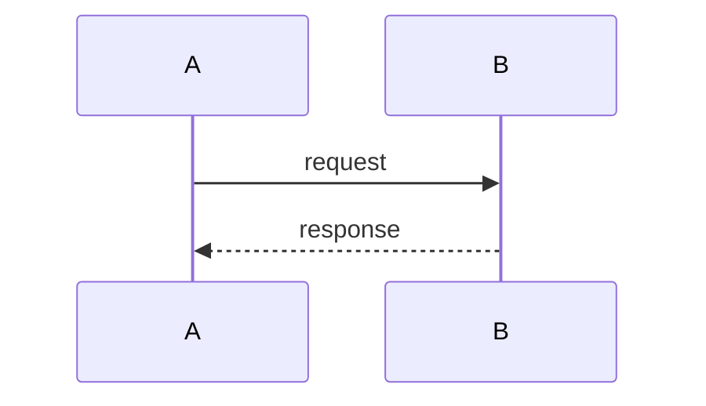

---
---

# Lab & Project Authoring Guide

This guide defines the structure and style for all documentation across the [DevOps Course 2026](https://github.com/DevOps-Course-2026) organization.
Following it ensures every lab and project doc looks and reads consistently.

---

## Lab Folder Structure

Each lab has a **stub** at the repo root and **full content** under `docs/`:

```text
course-labs-monorepo/
├── lab-8/
│   └── README.md              ← stub: title + link to portal (no images)
└── docs/
    └── labs/
        └── lab-8/
            ├── index.md       ← required: full lab document (syncs to portal)
            └── assets/        ← screenshots and diagrams
```

The `docs/` tree syncs automatically to the portal on every push to `main`.
The root `README.md` is GitHub-browsable only — keep it to a title and a portal link.

---

## Lab Document Structure (`docs/labs/lab-N/index.md`)

Every lab `index.md` must follow this section order:

```text
# Lab N — <Title>

## Prerequisites
## Task 1 — <Name>
  ### Step 1 — ...
  ### Step 2 — ...
  ### Understanding <concept>   ← explain what just happened
  ### Summary
## Task 2 — <Name>
  ...
## Deep Dive — <Topic>          ← optional, for internals/advanced content
```

### Rules

- **H1** (`#`) — one per file, the lab title
- **H2** (`##`) — top-level sections: Prerequisites, Tasks, Deep Dive
- **H3** (`###`) — steps and sub-sections within a task
- **H4** (`####`) — named items within a sub-section (e.g., individual pods, concepts)
- Never skip heading levels (e.g., don't jump from H2 to H4)

---

## Writing Style

- Write in **second person** ("Run the following command", "You should see...")
- Use **present tense** ("This command creates...", not "This command will create...")
- Keep task steps **actionable** — each step should have a command or concrete action
- After every non-trivial command, explain **what it does** — not just what to type
- Mark production caveats explicitly with a `> **Production Note:**` blockquote

---

## Code Blocks

Always specify the language:

````markdown
```bash
kubectl get pods -n ingress-nginx
```

```yaml
apiVersion: apps/v1
kind: Deployment
```
````

Never use plain ` ``` ` without a language tag.

---

## Expected Output

Show expected terminal output after verification commands in a plain code block labeled `Expected Output`:

````markdown
#### Expected Output

```text
NAME                         READY   STATUS    RESTARTS
nginx-controller-xxx-xxx     1/1     Running   0
```
````

---

## Diagrams

Use **Mermaid** for all diagrams. Docusaurus renders them natively.

Prefer:

- `sequenceDiagram` — for communication flows between components
- `graph TD` — for architecture and dependency diagrams
- `flowchart LR` — for process/pipeline flows

````markdown

````

---

## Tables

Use tables for:

- Comparisons (e.g., addon vs Helm chart)
- Pod/resource summaries
- Security layer breakdowns

Always include a header row and align columns:

```markdown
| Column A | Column B | Column C |
|----------|----------|----------|
| value    | value    | value    |
```

---

## Deep Dive Sections

Deep dives are **optional** additions for internals, security implications, or production considerations. They must:

- Start with an H2: `## Deep Dive — <Topic>`
- Open with a blockquote marking it as optional:

  ```markdown
  > This section is optional. It covers internals beyond the scope of the lab steps.
  ```

- Not be required reading to complete the lab tasks

---

## Blockquotes

Reserved for:

- `> **Note:**` — neutral information worth highlighting
- `> **Production Note:**` — differences between local/lab setup and production
- `> **Warning:**` — something that can break the cluster or cause data loss
- Optional section markers (as in Deep Dive)

---

## Screenshots

- Store in `docs/labs/lab-N/assets/` alongside `index.md`
- Reference with a relative path: ``
- Always include alt text

---

## Linting

All repos use [`markdownlint`](https://github.com/DavidAnson/markdownlint) to enforce formatting.
Rules are defined in `.markdownlint.yaml` at each repo root.

The lint workflow runs automatically on every push and pull request via a reusable GitHub Actions workflow defined in this repo at [`.github/workflows/reusable-lint-docs.yml`](./.github/workflows/reusable-lint-docs.yml).

Run locally before pushing:

```bash
markdownlint-cli2 "**/*.md" 2>&1 | grep -E "^\S.*:.*error|^Summary"
```

`node_modules`, `build`, and `dist` are excluded automatically via `.markdownlint-cli2.yaml` at the workspace root.

---

## Platform Docs Style (docs-hub only)

Docs inside `docs-hub/docs/` are **Docusaurus portal docs**, not lab READMEs.
They follow a different set of conventions:

### Frontmatter

Every platform doc must start with a YAML frontmatter block:

```markdown
---
sidebar_position: 1
---
```

`sidebar_position` controls the order within the sidebar category. Use integers starting from `1`.

### Headings with Emojis

Platform docs may use a single emoji prefix on H1 to aid visual scanning in the sidebar:

```markdown
# 🔄 Distributed Docs & Auto-Sync
```

Lab READMEs do **not** use emojis in headings.

### Admonitions

Use Docusaurus admonition syntax for callouts. Never use raw blockquotes for
warnings or tips in platform docs — use the appropriate admonition type instead:

| Type | Use for |
| --- | --- |
| `:::note` | Neutral supplementary info |
| `:::tip` | Recommended practice |
| `:::info` | Context or background |
| `:::caution` | Something that may cause issues if ignored |
| `:::danger` | Something that will cause data loss or breakage |

Syntax:

```markdown
:::caution TODO
Migrate from PAT to a GitHub App once the org has 2-3+ satellite repos.
:::
```

### Links

Always use relative paths within the docs tree:

```markdown
[Sync Workflow](./auto-sync.md)
```

---

## Docusaurus-Specific Syntax

### Frontmatter Fields

```markdown
---
sidebar_position: 1          # order within parent category (required)
sidebar_label: "Short Name"  # override the label shown in sidebar (optional)
title: "Full Page Title"     # sets <title> tag (optional, defaults to H1)
---
```

### Admonition Syntax

```markdown
:::note
This is a note.
:::

:::tip
Preferred approach.
:::

:::caution
Something to be careful about.
:::

:::danger
This will break things.
:::
```

Admonitions support an optional title after the type keyword:

```markdown
:::caution Production difference
Self-signed certs are not valid in production.
:::
```

### MDX Components

`docs-hub` has MDX enabled. Avoid inline JSX unless you are adding a
dedicated component — keep content as plain Markdown where possible.

---

## Linting Quick-Reference

All repos use `markdownlint` with `default: true` (all rules on) plus the
explicit overrides in each repo's `.markdownlint.yaml`. The table below covers
every rule that is commonly violated or explicitly configured:

| Rule | Status | What it enforces |
| --- | --- | --- |
| MD007 | On — indent: 2 | Unordered list items indented with 2 spaces |
| MD013 | Off | No line-length limit |
| MD022 | On | Blank line before **and** after every heading |
| MD024 | On — siblings only | No duplicate headings unless in different parent sections |
| MD025 | On | Exactly one H1 per file |
| MD029 | On — ordered | Ordered lists use `1.` `2.` `3.` (not all `1.`) |
| MD030 | On — 1 space | One space after list marker (`-` or `1.`) |
| MD031 | On | Blank line before **and** after every fenced code block |
| MD032 | On | Blank line before **and** after every list block |
| MD033 | Off | Inline HTML is allowed |
| MD040 | On | Every fenced code block must declare a language tag |
| MD041 | On | First line of every file must be an H1 (`#`) |
| MD047 | On | File must end with a single newline character |

### Common mistakes

- Missing blank line before a list that follows a sentence — triggers **MD032**
- Opening a code block on the line immediately after prose — triggers **MD031**
- Code block with no language tag (` ``` ` alone) — triggers **MD040**
- File saved without trailing newline — triggers **MD047**
- Two headings with the same text in the same section — triggers **MD024**
