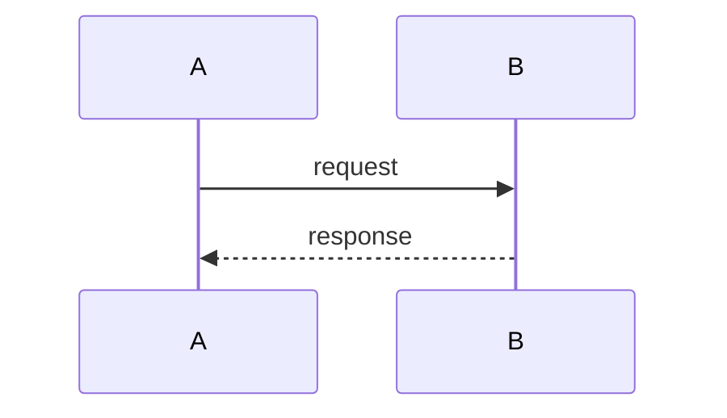

# 🗂️ Lab Authoring

Full reference for writing and structuring labs and documentation in
the DevOps Course 2026 organization.

---

## Lab Folder Structure

Each lab has a **stub** at the repo root and **full content** under `docs/`:

```text
course-labs-monorepo/
├── lab-N/
│   └── README.md              ← stub: title + link to portal (no images)
└── docs/
    └── labs/
        └── lab-N/
            ├── index.md       ← required: full lab document (syncs to portal)
            └── assets/        ← screenshots and diagrams
```

The `docs/` tree syncs automatically to the portal on every push to `main`.
The root `README.md` is GitHub-browsable only — keep it to a title and a portal link.

---

## Lab Document Structure

Every lab `docs/labs/lab-N/index.md` must follow this section order:

```text
# Lab N — <Title>

## Prerequisites
## Task 1 — <Name>
  ### Step 1 — ...
  ### Step 2 — ...
  ### Understanding <concept>
  ### Summary
## Task 2 — <Name>
  ...
## Deep Dive — <Topic>          ← optional
```

### Heading Rules

- **H1** (`#`) — one per file, the lab title
- **H2** (`##`) — top-level sections: Prerequisites, Tasks, Deep Dive
- **H3** (`###`) — steps and sub-sections within a task
- **H4** (`####`) — named items within a sub-section (e.g., individual pods, concepts)
- Never skip heading levels (e.g., do not jump from H2 to H4)

---

## Writing Style

- Write in **second person** ("Run the following command", "You should see...")
- Use **present tense** ("This command creates...", not "This command will create...")
- Keep task steps **actionable** — each step should have a command or concrete action
- After every non-trivial command, explain **what it does** — not just what to type
- Mark production caveats explicitly with a `> **Production Note:**` blockquote

---

## Code Blocks

Always specify the language:

````markdown
```bash
kubectl get pods -n ingress-nginx
```

```yaml
apiVersion: apps/v1
kind: Deployment
```
````

Never use plain ` ``` ` without a language tag.

---

## Expected Output

Show expected terminal output after verification commands in a plain code block
labeled `Expected Output`:

````markdown
#### Expected Output

```text
NAME                         READY   STATUS    RESTARTS
nginx-controller-xxx-xxx     1/1     Running   0
```
````

---

## Diagrams

Use **Mermaid** for all diagrams. Docusaurus renders them natively.

Prefer:

- `sequenceDiagram` — for communication flows between components
- `graph TD` — for architecture and dependency diagrams
- `flowchart LR` — for process/pipeline flows

````markdown

````

---

## Tables

Use tables for comparisons, pod/resource summaries, and security layer breakdowns.
Always include a header row and align columns:

```markdown
| Column A | Column B | Column C |
| --- | --- | --- |
| value    | value    | value    |
```

---

## Screenshots

- Store in `docs/labs/lab-N/assets/` alongside `index.md`
- Reference with a relative path: ``
- Always include alt text

---

## Blockquotes (Lab READMEs)

Reserved for:

- `> **Note:**` — neutral information worth highlighting
- `> **Production Note:**` — differences between local/lab setup and production
- `> **Warning:**` — something that can break the cluster or cause data loss

:::tip Platform docs use admonitions
Inside `docs-hub/docs/` use Docusaurus `:::note`, `:::tip`, `:::caution`, `:::danger`
syntax instead of raw blockquotes for callouts.
:::

---

## Linting

All repos use [`markdownlint`](https://github.com/DavidAnson/markdownlint).
Run locally before pushing:

```bash
markdownlint-cli2 "**/*.md" 2>&1 | grep -E "^\S.*:.*error|^Summary"
```

`node_modules`, `build`, and `dist` are excluded automatically via
`.markdownlint-cli2.yaml` at each workspace root.

### Rules Quick-Reference

| Rule | Status | What it enforces |
| --- | --- | --- |
| MD013 | Off | No line-length limit |
| MD022 | On | Blank line before **and** after every heading |
| MD025 | On | Exactly one H1 per file |
| MD031 | On | Blank line before **and** after every fenced code block |
| MD032 | On | Blank line before **and** after every list block |
| MD040 | On | Every fenced code block must declare a language tag |
| MD041 | On | First line of every file must be an H1 (`#`) |
| MD047 | On | File must end with a single newline character |

### Common Mistakes

- Missing blank line before a list that follows a sentence — triggers **MD032**
- Opening a code block on the line immediately after prose — triggers **MD031**
- Code block with no language tag — triggers **MD040**
- File saved without trailing newline — triggers **MD047**
- Two headings with the same text in the same section — triggers **MD024**
