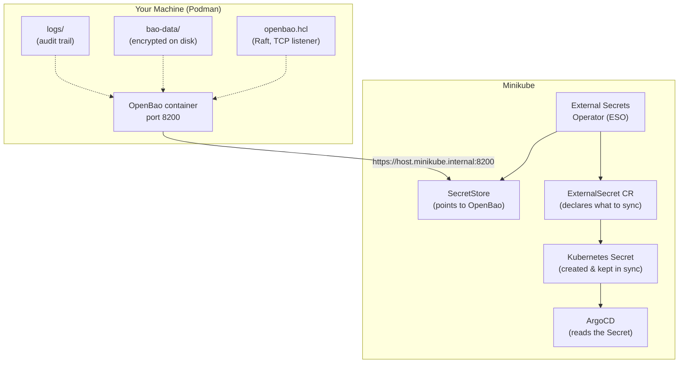
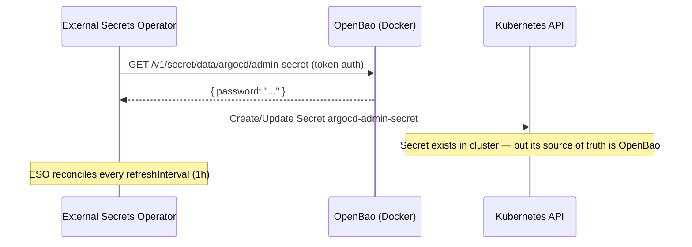

# Extra 1 — Secrets Management with OpenBao & ESO

> **Prerequisites:** You need a running Minikube cluster with ArgoCD installed in the `argocd` namespace. The lab stores ArgoCD credentials as a plain Kubernetes Secret — this extra replaces that with OpenBao as the source of truth.

This extra addresses the fundamental limitation exposed in Lab 8 Task 3: Kubernetes Secrets are base64-encoded, not encrypted. Anyone with `kubectl get secret` access can read them in seconds.

The solution is to move secrets entirely outside the cluster into a dedicated secrets store (**OpenBao**), and use the **External Secrets Operator (ESO)** to sync specific secrets into the cluster at runtime — only when and where they are needed.

---

## Architecture



---

## Prerequisites

- Lab 8 completed — Minikube running, ArgoCD installed in `argocd` namespace
- A running Minikube cluster with ArgoCD installed in the `argocd` namespace
- **Podman 4.4+** installed (`sudo dnf install podman`) — Quadlet is built in, no extra packages
- `helm` installed
- `kubectl` configured for your Minikube cluster

### One-Time: Allow the Service to Survive Logout (Optional)

> **Optional** — only needed if you want the container to keep running after you log out of your desktop session or SSH connection. On a dedicated server or CI runner you almost always want this. On a personal workstation where you always log back in, it is not required.

```bash
loginctl enable-linger $USER
```

Without linger: you SSH in, start OpenBao, then close the terminal — the container stops immediately. ESO's next secret sync attempt hits a connection refused on port 8200, and ArgoCD loses access to the credentials it needs to reach the cluster. The service is down until **you** (specifically your user, not just anyone) open a new session.

> The key detail: systemd tracks a `systemd --user` instance **per user**. Without linger, that instance is destroyed the moment your last session closes — it does not matter if root or another user is still logged in. With linger, your user's systemd instance is started at boot and stays alive permanently, so OpenBao keeps running even with zero active sessions.

With linger, systemd keeps the user session (and every service in it) alive as a background process after your last login closes. OpenBao stays running until the machine reboots.

The `LimitMEMLOCK=infinity` needed for `mlock()` is already set inside the Quadlet unit file's `[Service]` section — no separate drop-in file required.

---

## Task 1 — Understand the Repository Structure

The files for this extra live at `labs/extras/openbao-eso/` in the `course-labs-monorepo` root (not inside `docs/` — these are runnable infrastructure files, not portal content):

```text
labs/extras/openbao-eso/
├── Makefile              ← Single entry point for all operations (setup, install, verify, done)
├── openbao.container     ← Quadlet unit template (the only file you deploy)
├── config/
│   └── openbao.hcl       ← OpenBao server configuration (Raft, TLS, TCP listener)
├── certs/                ← Generated at runtime — TLS cert + key (gitignored)
├── bao-data/             ← Created at runtime — Raft storage (gitignored)
└── logs/                 ← Created at runtime — audit logs (gitignored)
```

The `bao-data/`, `logs/`, and `certs/` directories are gitignored. You create them (and generate the certs) before starting the container. Task 3 covers the full Quadlet setup.

At the monorepo root, a pre-commit hook lives at `.githooks/pre-commit`. Activate it once per clone:

```bash
# From course-labs-monorepo/
git config core.hooksPath .githooks
```

This blocks accidental commits of `keys.json`, `root_token.txt`, `.env`, and `*.key`, and warns you when infra files change without a corresponding doc update.

### Summary

You now know where the infrastructure files live (`labs/extras/openbao-eso/`), which directories are gitignored, and that the pre-commit hook is active.

---

## Task 2 — Activate the Pre-Commit Hook

Run once per clone of the repo to register the pre-commit hook:

```bash
# From course-labs-monorepo/
git config core.hooksPath .githooks
```

Verify it is active:

```bash
git config core.hooksPath
# Should print: .githooks
```

The hook enforces three things on every `git commit`:

| Trigger | Action |
| --- | --- |
| `keys.json`, `root_token.txt`, `.env`, `*.key` staged | **Blocks** the commit |
| Infra files changed without doc update | **Warns** (does not block) |
| `openbao.container` changed | Reminds you to re-render and redeploy the unit (see Task 3) |

### Summary

The pre-commit hook is active. It blocks secret files from being committed and warns on infra changes without a doc update.

> **Make alternative:** `make hooks` runs the same `git config` command above.

---

## Task 3 — Start OpenBao

OpenBao runs as a rootless Podman container managed by **Quadlet** — the systemd-native container runtime built into Podman 4.4+. Quadlet reads `~/.config/containers/systemd/openbao.container`, generates a real systemd unit from it, and manages the container lifecycle through `systemctl`.

> **Why Quadlet and not Podman Compose?** SOC 2 requires every infrastructure change to be traceable — who changed it, when, and with whose approval. With Quadlet, `Image=docker.io/openbao/openbao:2.5.1` lives in a committed file. Bumping it to `2.6.0` is a Pull Request: reviewed, approved, merged, timestamped. Tools like Renovate Bot open those PRs automatically. With Compose and `.env` files, none of that history exists.

---

### Setup — Directories, Certificates, and Permissions

This section shows every step manually so you understand what each command does. At the end, `make setup` automates all of it.

All commands run from `labs/extras/openbao-eso/`.

#### Step 1 — Create the Runtime Directories

```bash
mkdir -p bao-data logs certs
```

| Directory | Purpose |
| --- | --- |
| `bao-data/` | Raft storage — OpenBao writes its encrypted database here |
| `logs/` | Audit log output — mounted read-write so OpenBao can append |
| `certs/` | TLS certificate and private key — mounted read-only into the container |

All three are in `.gitignore`. They are created on the host and bind-mounted into the container.

#### Step 2 — Generate a Self-Signed TLS Certificate

```bash
openssl req -x509 -newkey rsa:4096 -days 365 -nodes \
  -keyout certs/bao.key \
  -out    certs/bao.crt \
  -subj   "/CN=openbao" \
  -addext "subjectAltName=DNS:host.minikube.internal,IP:127.0.0.1"
```

| Flag | Meaning |
| --- | --- |
| `-x509` | Output a self-signed certificate, not a CSR |
| `-newkey rsa:4096` | Generate a new 4096-bit RSA key pair at the same time |
| `-days 365` | Certificate is valid for one year |
| `-nodes` | Do not encrypt the private key with a passphrase (container needs to read it at startup without a human present) |
| `-keyout certs/bao.key` | Write the private key here |
| `-out certs/bao.crt` | Write the public certificate here |
| `-subj "/CN=openbao"` | Common Name — appears in the cert subject |
| `-addext "subjectAltName=..."` | Required by modern TLS clients — `CN` alone is ignored. `DNS:host.minikube.internal` is the hostname Minikube uses to reach your host machine. `IP:127.0.0.1` allows local `curl` to verify the cert. Without this, ESO rejects the certificate with a hostname mismatch error. |

#### Step 3 — Lock Down Permissions

```bash
chmod 400 certs/bao.key   # private key: read-only by owner only
chmod 444 certs/bao.crt   # public cert: readable by everyone
```

`chmod 400` on the private key means no process — including other users and the container runtime — can overwrite it. The container mounts `certs/` as `:ro,U,Z` (read-only + auto-chown + SELinux label), so it can read both files but cannot write to them.

`chmod 444` on the certificate is intentional: the public cert is not secret. curl, ESO, ArgoCD, and any other TLS client needs to read it.

#### Step 4 — Add the CA to the System Trust Store

```bash
sudo cp certs/bao.crt /etc/pki/ca-trust/source/anchors/bao.crt
sudo update-ca-trust
```

This makes your workstation trust the self-signed certificate system-wide — `curl https://host.minikube.internal:8200` will succeed without `-k`. Minikube also inherits system trust when it is launched after this step.

This step requires `sudo` because it writes to a system directory — the only step in the whole setup that does.

#### Automated Equivalent

Once you have run through the steps above and understand what each does, `make setup` + `make trust` run the same sequence:

```bash
make setup   # steps 1-3: dirs, certs, chmod (no sudo required)
make trust   # step 4: adds CA to system trust store (requires sudo)
```

> **What `make setup` does:** `subjectAltName=DNS:host.minikube.internal` is required — it is the hostname Minikube uses to reach your host. Without it, ESO rejects the certificate with a hostname mismatch error. The `chmod 400` on `bao.key` prevents any process or user on the machine from overwriting the private key accidentally.

---

### Quadlet — Install and Start

> Podman 4.4+ reads `~/.config/containers/systemd/*.container` files and generates real systemd units from them — no extra packages, full journald integration, and `LimitMEMLOCK` in the unit file itself. Version and port are **hardcoded** in `openbao.container` — every change is a committed PR, not a local file edit.

#### Step 1 — Understand the Unit Template

Before deploying, read the template:

```bash
cat openbao.container
```

Key things to observe:

- `Image=docker.io/openbao/openbao:2.5.1` — hardcoded, not a variable
- `UserNS=keep-id:uid=100,gid=100` — maps host UID 1000 → container UID 100 (`openbao` user), so volume ownership works without `sudo chown`
- `Volume=${BAODIR}/config:/openbao/config:ro,U,Z` — `${BAODIR}` is the **only** substituted variable; `:U` auto-chowns the host directory to the container UID; `:Z` sets a private SELinux MCS label
- `AddCapability=IPC_LOCK` — allows `mlock()` to prevent secrets touching swap
- `NoNewPrivileges=true` — the process cannot escalate its own privileges
- `Environment=BAO_ADDR=https://127.0.0.1:8200` — CLI connection address; must match the TLS cert's SAN (`0.0.0.0` is only the bind address, not a valid TLS name)
- `Environment=BAO_CACERT=/openbao/config/certs/bao.crt` — CA cert for the CLI to verify the server's TLS certificate
- `LimitMEMLOCK=infinity` in `[Service]` — removes the rootless memlock limit
- `Restart=on-failure` in `[Service]` — systemd restarts the container if it crashes

| Field | Explanation |
| --- | --- |
| `Image=docker.io/openbao/openbao:2.5.1` | Fully qualified image reference — pinned to an exact version, [never `latest`](#deep-dive--why-you-should-never-use-latest--and-how-to-stay-up-to-date) |
| `ContainerName=openbao-server` | Fixed container name so `make logs`, `make verify`, and `make restart` can reference it by name |
| `UserNS=keep-id:uid=100,gid=100` | Maps host UID 1000 → container UID 100 (`openbao` user). Without this, volume directories owned by your host user would be inaccessible to the container process |
| `AddCapability=IPC_LOCK` | Grants `CAP_IPC_LOCK` so the process can call `mlock()` and prevent secrets from being swapped to disk |
| `NoNewPrivileges=true` | Prevents the container process from gaining new privileges via setuid binaries |
| `PublishPort=8200:8200` | Forwards host port 8200 to container port 8200 — the OpenBao API and UI port |
| `Volume=…/config:/openbao/config:ro,U,Z` | Mounts the config directory read-only. `:U` auto-chowns it to the container UID/GID so the `openbao` user can read it. `:Z` sets a private SELinux MCS label — required on Fedora to prevent `Permission denied` from SELinux |
| `Volume=…/certs:/openbao/config/certs:ro,U,Z` | Mounts TLS cert and key read-only into a subdirectory of the config mount. Same `:U,Z` flags for the same reasons |
| `Volume=…/bao-data:/openbao/data:U,Z` | Read-write mount for Raft storage — OpenBao writes its encrypted database here |
| `Volume=…/logs:/openbao/logs:U,Z` | Read-write mount for audit logs — OpenBao appends to this on every operation |
| `Environment=BAO_ADDR=https://127.0.0.1:8200` | Tells the OpenBao CLI inside the container where the server API is. Must match an IP/hostname in the TLS cert's SAN — `0.0.0.0` is the bind address (all interfaces) and is not a valid TLS subject. `https://` because TLS is enabled in `openbao.hcl` |
| `Environment=BAO_CACERT=/openbao/config/certs/bao.crt` | CA certificate the CLI uses to verify the server's TLS certificate. Without this, every `bao` command inside the container fails with `x509: certificate signed by unknown authority` — the self-signed cert is not in the container's system trust store |
| `Exec=bao server -config=…` | Explicit startup command — works regardless of the image's `ENTRYPOINT` |
| `LimitMEMLOCK=infinity` | Removes the rootless memlock limit for this unit — no separate systemd drop-in file needed, unlike Podman Compose |
| `Restart=on-failure` | systemd restarts the container if it exits non-zero — not if you manually stop it with `systemctl stop` |
| `WantedBy=default.target` | Starts the service on user login when `systemctl --user enable` is run |

#### Step 2 — Render the Template Manually

Quadlet requires absolute paths. `${BAODIR}` substitutes your current directory:

> **Prerequisite — no spaces in the repo path.** The `:Z` suffix on volume mounts tells Podman to SELinux-relabel the volume contents via `lsetxattr()`. This call fails when the path contains spaces (e.g. `DevOps Course 2026/`), producing a `Permission denied (lsetxattr)` error at container start. Clone the repo to a path without spaces — for example `~/devops-course/` — before running this step.

```bash
export BAODIR=$(pwd)
```

Inspect what the rendered unit will look like **before** writing it anywhere:

```bash
envsubst '${BAODIR}' < openbao.container
```

Verify that `Volume=` lines now show real absolute paths and `Image=` is untouched. Then write it to the Quadlet directory:

```bash
mkdir -p ~/.config/containers/systemd
envsubst '${BAODIR}' < openbao.container \
  > ~/.config/containers/systemd/openbao.container
```

Why `envsubst '${BAODIR}'` and not plain `envsubst`? Without the quoted variable list, `envsubst` replaces **every** `$VARIABLE` in the file — including the ones inside comments. Quoting the list limits substitution to exactly `${BAODIR}`.

#### Step 3 — Lock the Deployed Unit

```bash
chmod 400 ~/.config/containers/systemd/openbao.container
```

The deployed unit is now read-only. You cannot edit it in-place. To update it you must:

1. Change `openbao.container` in the repo
2. Commit
3. Re-render: temporarily unlock, overwrite, re-lock:

```bash
chmod 600 ~/.config/containers/systemd/openbao.container
envsubst '${BAODIR}' < openbao.container \
  > ~/.config/containers/systemd/openbao.container
chmod 400 ~/.config/containers/systemd/openbao.container
```

This is the filesystem-level enforcement of the SOC 2 principle: no change without a git record.

#### Step 4 — Reload Systemd and Start

```bash
systemctl --user daemon-reload
systemctl --user start openbao.service
```

`daemon-reload` tells systemd to scan `~/.config/containers/systemd/` and generate a real `.service` unit from your `.container` file. Without it, systemd does not know the unit exists yet.

Verify the service started:

```bash
systemctl --user is-active openbao.service
```

#### Step 5 — Enable Auto-Start and (Optionally) Survive Logout

```bash
systemctl --user enable openbao.service
```

`systemctl --user enable` adds the service to `default.target` so it starts automatically on your next login.

**Optional — survive logout:**

```bash
loginctl enable-linger $USER
```

`loginctl enable-linger` keeps the user session (and all user services) alive after logout — without this, the container stops when your last session closes. Run it if this machine needs to keep serving OpenBao even when you are not logged in.

#### Automated Equivalent

Once you understand each step, the Makefile runs the same sequence with the git-clean gate:

```bash
make install   # git-clean check → render → chmod 400 → daemon-reload
make start     # systemctl start + is-active check
make enable    # systemctl enable + loginctl enable-linger
```

`make install` adds one thing the manual steps do not: it refuses to run if you have uncommitted changes (`check-git-clean`). Deployed state must match git history — that is the whole point.

Verify the substitution — `Volume=` lines should show absolute paths, `Image=` should be unchanged:

```bash
grep -E "^(Image|PublishPort|Volume)" ~/.config/containers/systemd/openbao.container
```

#### Step 6 — Verify

Run three checks to confirm the service is healthy.

**Check 1 — Drift detection.** Re-render the template and diff it against the deployed unit:

```bash
export BAODIR=$(pwd)
envsubst '${BAODIR}' < openbao.container \
  | diff - ~/.config/containers/systemd/openbao.container \
  && echo "  [ok] no drift"
```

No `diff` output (and the `[ok]` line printed) means the deployed unit exactly matches what is in git.

**Check 2 — Service status:**

```bash
systemctl --user is-active openbao.service
```

#### Expected Output

```text
active
```

**Check 3 — OpenBao seal status:**

```bash
podman exec openbao-server bao status
```

#### Expected Output — Seal Status

```text
Key                Value
---                -----
Seal Type          shamir
Initialized        false
Sealed             true
```

All three must pass before continuing.

> **Make alternative:** `make verify` runs all three checks in sequence.

#### Step 7 — Test Auto-Recovery

Verify that Quadlet's `Restart=on-failure` actually works — this is the availability pillar of SOC 2:

```bash
systemctl --user restart openbao.service
sleep 2
systemctl --user is-active openbao.service
```

#### Expected Output — Auto-Recovery

```text
active
```

`active` confirms the service recovered. If not, inspect the logs:

```bash
journalctl --user -u openbao.service --no-pager -n 50
```

> **Make alternative:** `make restart` runs the restart, waits, and checks recovery in one command. `make logs` tails live logs.

---

OpenBao starts **uninitialized and sealed**. The next task walks through what that means and how to fix it.

### Summary

OpenBao is running as a rootless Quadlet service. Directories, certs, and permissions are in place. The container auto-recovers on failure and (optionally) survives logout.

---

## Task 4 — Initialize and Unseal OpenBao

### Understanding Seal and Unseal

OpenBao stores all its data encrypted at rest using a **master key**. The master key is itself split into **key shares** using Shamir's Secret Sharing — no single piece is the full key.

When OpenBao starts, it does not have the master key in memory. It is **sealed** — it can receive requests but cannot decrypt anything or serve secrets. You must provide enough key shares to reconstruct the master key. This process is called **unsealing**.

> **Production Note:** In production you automate unsealing using **auto-unseal** — OpenBao delegates the master key encryption to an external KMS (AWS KMS, GCP KMS, Azure Key Vault). The container unseals itself on startup without human intervention. Manual unsealing is acceptable for local development only.

---

### Step 1 — Initialize OpenBao

Initialization generates the master key and splits it into shares. Run it exactly once per cluster:

```bash
podman exec openbao-server bao operator init -key-shares=3 -key-threshold=2 | tee bao-init.txt
```

Breaking this down:

| Part | What it does |
| --- | --- |
| `podman exec openbao-server` | Run a command inside the running container named `openbao-server` |
| `bao operator init` | OpenBao CLI command that initializes the server for the first time |
| `-key-shares=3` | Split the master key into 3 pieces (key shares) |
| `-key-threshold=2` | Require any 2 of the 3 shares to unseal — no single person holds the full key |
| `\| tee bao-init.txt` | Print the output to the terminal **and** save it to `bao-init.txt` at the same time (`bao-init.txt` is already in `.gitignore`) |

> **Make alternative:** `make init` runs the same command and prints a reminder to store the keys offline.

#### Expected Output

```text
Unseal Key 1: <key-1>
Unseal Key 2: <key-2>
Unseal Key 3: <key-3>

Initial Root Token: <root-token>
```

> **Warning:** Save all 3 unseal keys and the root token immediately. They are shown exactly once. If you lose the unseal keys, the data in `bao-data/` is permanently unrecoverable.

You have two options — pick one:

**Option A — save to `/tmp` (cleared on reboot):**

```bash
cat > /tmp/openbao-init.txt <<EOF
Unseal Key 1: <key-1>
Unseal Key 2: <key-2>
Unseal Key 3: <key-3>
Root Token:   <root-token>
EOF
```

**Option B — save inside the repo (gitignored, survives reboots):**

```bash
cat > openbao-init.txt <<EOF
Unseal Key 1: <key-1>
Unseal Key 2: <key-2>
Unseal Key 3: <key-3>
Root Token:   <root-token>
EOF
```

The `*-init.txt` pattern is in `.gitignore` — this file will never be committed.

### Step 2 — Unseal OpenBao

Provide 2 of the 3 key shares (the threshold you set in Step 1):

```bash
podman exec openbao-server bao operator unseal <key-1>
podman exec openbao-server bao operator unseal <key-2>
```

> **Make alternative:** `make unseal KEY=<key>` — run twice, once per share.

After the second key, verify the seal status:

```bash
podman exec openbao-server bao status
```

#### Expected Output

```text
Key             Value
---             -----
Seal Type       shamir
Initialized     true
Sealed          false
Total Shares    3
Threshold       2
```

`Sealed: false` — OpenBao is now operational.

### Step 3 — Log In with the Root Token

```bash
podman exec openbao-server bao login <root-token>
```

#### Expected Output

```text
Success! You are now authenticated. The token information displayed below
is already stored in the token helper.
```

> **Production Note:** The root token has unrestricted access to everything — treat it like the root password of a database. After initial setup, create a scoped admin token or use OIDC auth, and revoke the root token. For this lab we use it throughout for simplicity.

### Step 4 — Verify the Audit Log

The audit device is declared in `config/openbao.hcl`. API-driven audit device creation (`bao audit enable`) was **intentionally disabled** in OpenBao 2.5.x as a security fix for [CVE-2025-54997](https://github.com/openbao/openbao/security/advisories/GHSA-xp75-r577-cvhp) — file-type audit devices allowed writing to arbitrary paths, breaching privilege separation.

The device activates automatically when the server unseals (not at raw startup). Verify it is active:

```bash
podman exec openbao-server bao audit list
```

> **Make alternative:** `make audit-enable` runs the same verification.

#### Expected Output

```text
Path          Type    Description
----          ----    -----------
audit-log/    file    n/a
```

### Summary

OpenBao is initialized, unsealed, and logged in. An audit log records every operation from this point forward.

---

## Task 5 — Store the ArgoCD Secret in OpenBao

### Step 1 — Enable the KV Secrets Engine

OpenBao supports multiple **secrets engines** — pluggable backends for different secret types (KV, database credentials, PKI, etc.). Enable the KV v2 engine at the `secret/` path:

```bash
podman exec openbao-server bao secrets enable -path=secret kv-v2
```

#### Expected Output

```text
Success! Enabled the kv-v2 secrets engine at: secret/
```

### Step 2 — Store the ArgoCD Admin Password

Write the ArgoCD admin password into OpenBao:

```bash
podman exec openbao-server bao kv put secret/argocd/admin-secret \
  password="<your-argocd-initial-password>"
```

Replace `<your-argocd-initial-password>` with the value you retrieved in Lab 8 Task 3 Step 3.

Verify it was stored:

```bash
podman exec openbao-server bao kv get secret/argocd/admin-secret
```

#### Expected Output

```text
====== Data ======
Key         Value
---         -----
password    <your-argocd-initial-password>
```

### Step 3 — Create a Policy for ESO

Policies in OpenBao follow **least-privilege** — you grant access only to the specific paths and operations needed. Create a policy that allows ESO to read only the ArgoCD secrets:

```bash
cat > /tmp/eso-policy.hcl <<EOF
path "secret/data/argocd/*" {
  capabilities = ["read"]
}
EOF
```

Write it to OpenBao:

```bash
podman exec -i openbao-server bao policy write eso-argocd - < /tmp/eso-policy.hcl
```

#### Expected Output

```text
Success! Uploaded policy: eso-argocd
```

### Step 4 — Create a Token for ESO

Create a long-lived token scoped to the `eso-argocd` policy:

```bash
podman exec openbao-server bao token create \
  -policy=eso-argocd \
  -display-name=eso-argocd \
  -ttl=8760h
```

#### Expected Output

```text
Key                  Value
---                  -----
token                <eso-token>
token_accessor       <accessor>
token_duration       8760h
token_renewable      false
token_policies       ["default" "eso-argocd"]
```

Save the `token` value — you will use it in Task 7.

> **TODO (Kubernetes Auth Method):** This static token is a temporary credential that must be manually rotated. The production pattern is to use OpenBao's **Kubernetes auth method** instead — ESO authenticates using its pod's service account JWT, which OpenBao verifies directly with the Kubernetes API. No static tokens. No expiry management. Covered in a future extra.

### Summary

The ArgoCD admin password is stored in OpenBao at `secret/argocd/admin-secret`. A scoped policy (`eso-argocd`) limits ESO to read-only access on that path.

---

## Task 6 — Install the External Secrets Operator

The **External Secrets Operator (ESO)** is a Kubernetes controller that reads `ExternalSecret` custom resources and syncs the referenced values from an external store into native Kubernetes Secrets.

### Step 1 — Add the ESO Helm Repository

```bash
helm repo add external-secrets https://charts.external-secrets.io
helm repo update
```

### Step 2 — Install ESO

```bash
helm install external-secrets \
  external-secrets/external-secrets \
  -n external-secrets \
  --create-namespace
```

### Step 3 — Verify the Installation

```bash
kubectl get pods -n external-secrets
```

#### Expected Output

```text
NAME                                                READY   STATUS    RESTARTS
external-secrets-xxxxxxxxxx-xxxxx                   1/1     Running   0
external-secrets-cert-controller-xxxxxxxxxx-xxxxx   1/1     Running   0
external-secrets-webhook-xxxxxxxxxx-xxxxx           1/1     Running   0
```

### Summary

ESO is installed in the `external-secrets` namespace. Its CRDs (`SecretStore`, `ExternalSecret`) are now available cluster-wide.

---

## Task 7 — Connect ESO to OpenBao

### Step 1 — Verify OpenBao is Reachable from Minikube

On Linux, Minikube can reach your host machine at `host.minikube.internal`. Because TLS is enabled, pass the certificate for verification:

```bash
minikube ssh -- curl -s --cacert /dev/stdin \
  https://host.minikube.internal:8200/v1/sys/health \
  < certs/openbao.crt
```

#### Expected Output

```text
{"initialized":true,"sealed":false,...}
```

### Step 2 — Create the ESO Token Secret

ESO needs the OpenBao token to authenticate. Store it as a Kubernetes Secret in the `argocd` namespace:

```bash
kubectl create secret generic openbao-token \
  -n argocd \
  --from-literal=token=<eso-token>
```

Replace `<eso-token>` with the token from Task 5 Step 4.

> **Production Note:** This is a static token stored in a Kubernetes Secret — exactly the problem we are solving. This is the **Secret Zero** problem: something has to authenticate to the secrets store, and that credential itself needs to be stored somewhere. The Kubernetes auth method (see TODO section below) eliminates this by using the pod's native service account identity instead of a pre-shared token.

### Step 3 — Create a SecretStore

A `SecretStore` tells ESO where the secrets store is and how to authenticate to it. Create `secretstore.yaml`:

```yaml
apiVersion: external-secrets.io/v1beta1
kind: SecretStore
metadata:
  name: openbao
  namespace: argocd
spec:
  provider:
    vault:
      server: "https://host.minikube.internal:8200"
      path: "secret"
      version: "v2"
      caBundle: "<base64-encoded-openbao.crt>"  # see step below
      auth:
        tokenSecretRef:
          name: openbao-token
          key: token
```

Before applying, replace `<base64-encoded-openbao.crt>` with the actual base64-encoded certificate:

```bash
cat certs/bao.crt | base64 -w 0
```

Paste the output into `caBundle` in `secretstore.yaml`, then apply:

```bash
kubectl apply -f secretstore.yaml
```

### Step 4 — Verify the SecretStore is Ready

```bash
kubectl get secretstore openbao -n argocd
```

#### Expected Output

```text
NAME       AGE   STATUS   CAPABILITIES   READY
openbao    10s   Valid    ReadWrite      True
```

`READY: True` confirms ESO can successfully authenticate and reach OpenBao.

### Summary

A `SecretStore` in the `argocd` namespace points to your host-local OpenBao instance over TLS. ESO authenticates with the scoped token from Task 5.

---

## Task 8 — Sync the ArgoCD Secret

### Step 1 — Create an ExternalSecret

An `ExternalSecret` declares what to fetch from the store and what Kubernetes Secret to create. Create `externalsecret-argocd.yaml`:

```yaml
apiVersion: external-secrets.io/v1beta1
kind: ExternalSecret
metadata:
  name: argocd-admin-secret
  namespace: argocd
spec:
  refreshInterval: 1h
  secretStoreRef:
    name: openbao
    kind: SecretStore
  target:
    name: argocd-admin-secret
    creationPolicy: Owner
  data:
    - secretKey: password
      remoteRef:
        key: argocd/admin-secret
        property: password
```

Apply it:

```bash
kubectl apply -f externalsecret-argocd.yaml
```

### Step 2 — Verify the Sync

```bash
kubectl get externalsecret argocd-admin-secret -n argocd
```

#### Expected Output

```text
NAME                   STORE     REFRESH INTERVAL   STATUS         READY
argocd-admin-secret    openbao   1h                 SecretSynced   True
```

Check the resulting Kubernetes Secret was created:

```bash
kubectl get secret argocd-admin-secret -n argocd
```

Decode it to verify the value matches what you stored in OpenBao:

```bash
kubectl get secret argocd-admin-secret -n argocd \
  -o jsonpath="{.data.password}" | base64 --decode && echo
```

### Understanding What Just Happened



The secret now lives in OpenBao as the source of truth. The Kubernetes Secret is a **derived, auto-refreshed copy**. If you update the value in OpenBao, ESO syncs it within the `refreshInterval` automatically.

### Summary

An `ExternalSecret` in the `argocd` namespace syncs the admin password from OpenBao into a native Kubernetes Secret. ArgoCD reads that Secret — it has no direct connection to OpenBao.

---

## Summary

| What you did | Why it matters |
| --- | --- |
| Ran OpenBao in Docker with `IPC_LOCK` | Memory-safe, no swap exposure |
| Initialized with Shamir key shares | No single person holds the full key |
| Enabled audit log | Every read and write is recorded |
| Created a scoped policy for ESO | Least-privilege — ESO can only read `argocd/*` |
| Installed ESO via Helm | Standard Kubernetes-native sync controller |
| Created SecretStore pointing to OpenBao | Decouples auth config from individual secrets |
| Created ExternalSecret | Declarative sync — the Secret is owned and refreshed by ESO |

The ArgoCD admin secret now follows: **OpenBao (source of truth) → ESO (sync) → Kubernetes Secret (runtime copy)**. Nothing sensitive ever lives in Git.

---

## TODO — Layers to Implement

The following improvements complete the full production-grade secrets stack. Each is a candidate for a future extra.

### TODO 1 — Kubernetes Auth Method (eliminate the static token)

Replace the `openbao-token` Kubernetes Secret with OpenBao's native Kubernetes auth method:

- OpenBao verifies ESO's pod service account JWT directly with the Kubernetes API
- No pre-shared static token
- No manual token rotation
- Credentials expire automatically with the pod lifecycle

Reference: [OpenBao Kubernetes Auth Method](https://openbao.org/docs/auth/kubernetes/)

### TODO 2 — Production-Grade TLS for OpenBao

This lab uses a self-signed certificate generated with `openssl`. In production:

- Use **cert-manager** to issue and auto-rotate the certificate from a trusted CA
- Or use an internal PKI (e.g., OpenBao's own PKI secrets engine as a CA)
- Distribute the CA bundle to all consumers (ESO, ArgoCD vault plugin, etc.) via a `ConfigMap` rather than hardcoding it in each `SecretStore`

### TODO 3 — Auto-Unseal

Manual unsealing does not survive container restarts in production. Implement auto-unseal using:

- **Local dev:** OpenBao's transit engine on a second OpenBao instance
- **Production:** AWS KMS, GCP KMS, or Azure Key Vault

Reference: [OpenBao Auto-Unseal](https://openbao.org/docs/configuration/seal/)

### TODO 4 — Dynamic Secrets

Static passwords are a liability — they never expire and must be rotated manually. OpenBao's **database secrets engine** generates short-lived credentials on demand:

- A requesting pod gets a unique username/password valid for 1 hour
- OpenBao automatically revokes it after the TTL
- No static credentials anywhere

This eliminates the credential rotation problem entirely. Applicable to: PostgreSQL, MySQL, MongoDB, Redis, and cloud IAM credentials.

### TODO 5 — SOPS for Git-Encrypted Secrets

Any secrets stored in Git (Helm values, Kustomize overlays) should be encrypted before commit using **SOPS + age**:

- Encrypt: `sops --encrypt --age <recipient> values-secret.yaml > values-secret.enc.yaml`
- Decrypt at deploy time: `sops --decrypt values-secret.enc.yaml | helm install ...`

Combine with OpenBao for a complete story: dynamic secrets at runtime, encrypted static config in Git.

### TODO 6 — Secret Rotation Alerting

When ESO fails to sync (OpenBao unreachable, token expired, policy changed), a Kubernetes Secret can silently go stale. Add:

- Prometheus alerts on `externalsecret_sync_calls_error_total`
- ArgoCD notifications on sync failures that touch secrets

### TODO 7 — Image Digest Pinning

`Image=openbao/openbao:2.5.1` uses a tag. Tags are mutable — a registry administrator can push a different image to the same tag after you pinned your unit file. For full supply-chain security, pin by SHA256 digest:

```ini
Image=openbao/openbao@sha256:<digest>
```

Get the digest for a specific tag:

```bash
podman pull openbao/openbao:2.5.1 --quiet
podman inspect openbao/openbao:2.5.1 --format '{{.Digest}}'
```

Combine with Renovate Bot: when a new version is released, Renovate opens a PR that updates both the tag (for readability) and the digest (for immutability) in one commit.

> **Why it matters:** With a tag-only pin, a compromised or mistakenly updated image could be pulled the next time the container restarts — without any change to your committed files. A digest pin makes the image reference cryptographically immutable. No change to the file = no different image, ever.

---

## Deep Dive — Why You Should Never Use `latest` — and How to Stay Up to Date

> This section is optional. It explains why pinning an explicit image version matters and how to keep it current without manual checking.

The `latest` tag is a pointer that moves. Every time the image maintainer publishes a new release, `latest` silently points to a different image. This creates three problems:

**1. Invisible breaking changes.** A new major version of OpenBao can change the storage format, the API, or the configuration schema. If you use `latest`, the next time your container restarts — after a reboot, a crash, or a `podman pull` — it may start a completely different version than before, with no change to any file you committed.

**2. No audit trail.** If something breaks after an upgrade, you cannot answer "what changed?" There is no commit, no diff, no timestamp. The image changed on the registry; nothing changed in your repo.

**3. Non-reproducible environments.** Two machines that both run `latest` may be running different versions depending on when they last pulled. Debugging becomes guesswork.

**The rule:** always pin to an explicit version tag — `openbao:2.5.1`, not `openbao:latest`.

---

**How to stay up to date without using `latest`:**

Pinning does not mean staying on old versions forever. It means *you control when you upgrade*, and the upgrade is a deliberate, traceable act.

**Manual approach:** Check the [OpenBao releases page](https://github.com/openbao/openbao/releases) periodically. When a new version is published, update `OPENBAO_VERSION` in `.env.example`, commit, and test.

**Automated approach — Renovate Bot or Dependabot:** These tools watch container registries and open Pull Requests automatically when a new version is available:

```yaml
# .github/renovate.json (example)
{
  "$schema": "https://docs.renovatebot.com/renovate-schema.json",
  "containerbase": { "enabled": true }
}
```

When `openbao:2.6.0` is published, Renovate opens a PR that bumps the version in `.env.example` (and `openbao.container` for Quadlet). You review it, run tests, and merge. The merge commit is your audit trail — who approved it, when, and what changed. This is the production pattern referenced in the Quadlet unit file header.

---

## Deep Dive — Why `IPC_LOCK` Matters

> This section is optional. It covers the memory security mechanism behind the `cap_add: IPC_LOCK` setting in compose.yaml.

Operating systems use **virtual memory** — when physical RAM is under pressure, pages of memory can be written to disk (swap). For most applications this is invisible and harmless.

For a secrets manager it is a serious risk: a secret that existed only in memory could be written unencrypted to `/swapfile` on the host disk, where it persists after the container exits and is accessible to anyone with disk access.

`IPC_LOCK` grants the process the `CAP_IPC_LOCK` Linux capability, which allows it to call `mlock()` — a system call that pins specific memory pages and tells the kernel: *never swap this to disk, ever*.

OpenBao calls `mlock()` on all memory pages that hold sensitive data (unsealed keys, plaintext secret values, auth tokens). With `IPC_LOCK` present, this works. Without it, the `mlock()` call fails, OpenBao logs a warning, and continues — but your secrets are at risk of touching disk.

> **Production Note:** If you are running OpenBao on a host where swap is disabled entirely (common in hardened production environments), `IPC_LOCK` is still required — OpenBao refuses to start in production mode without it unless you explicitly set `disable_mlock = true` in the config, which is documented as insecure.

---

## Deep Dive — Swap, mlock, and the "Disable Swap" Production Pattern

> This section is optional. It covers the production alternative to `ulimits.memlock` and why Fedora's zram changes the picture slightly.

The `ulimits.memlock: -1` + `IPC_LOCK` combination is the defensive approach: swap exists, so we use `mlock()` to make sure secrets never reach it. But there is a cleaner alternative used in hardened production environments: **disable swap entirely**.

If there is no swap, there is nothing to lock against. The kernel cannot write memory pages to disk because there is no disk-backed swap space. In that case:

- `ulimits.memlock: -1` is unnecessary — there is no limit to worry about
- `cap_add: IPC_LOCK` is still required — OpenBao calls `mlock()` at startup and refuses to run without the capability unless you explicitly set `disable_mlock = true`
- `disable_mlock = true` in `openbao.hcl` tells OpenBao to skip the `mlock()` call entirely — safe only when you have confirmed swap is off

This is the standard pattern on hardened servers, cloud VMs (which typically have no swap by default), and Kubernetes nodes where swap is disabled as a kubelet prerequisite.

**Why this lab keeps `ulimits.memlock: -1`:** most dev workstations have swap enabled. Requiring students to disable swap — or verify it is off — before running the lab adds risk (OOM on a memory-constrained machine) and complexity that is out of scope.

---

**A note on Fedora and zram:**

Fedora workstations use **zram** by default instead of a traditional disk-backed swap partition. zram is a compressed in-memory swap device — swap pages are compressed and stored in RAM itself, not on disk.

This means a secret that gets "swapped" on a zram system stays compressed in memory, never touches a physical disk, and disappears when the system powers off. It is meaningfully more secure than disk swap from a secrets-at-rest perspective.

In practice this puts Fedora workstations in a middle ground: not as strict as "swap fully disabled" (secrets can still leave the mlock-protected region into zram), but not as risky as disk swap (no unencrypted secrets survive a reboot on disk). For a lab environment on Fedora, the existing `IPC_LOCK` + `ulimits.memlock: -1` setup is the right call regardless.

For reference: `zramctl` shows active zram devices; `swapon --show` shows all swap including zram.
