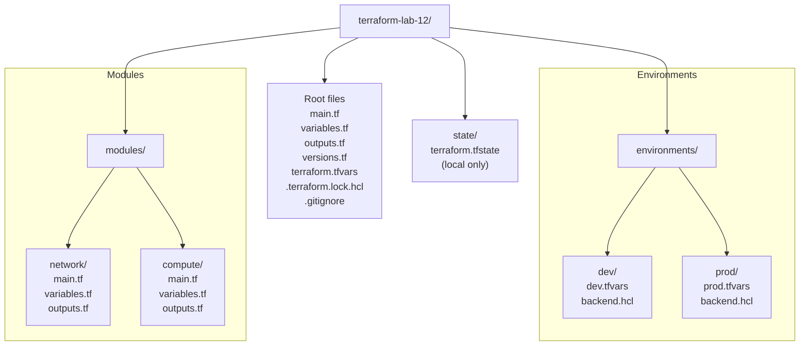

# Lab 12 - IaC: Infrastructure as Code

## Intro: Terraform project structure (dev + prod)

The structure above is a common pattern for real projects: shared module code in `modules/`, environment-specific values in `environments/dev` and `environments/prod`, and root-level configuration plus version lock files.
