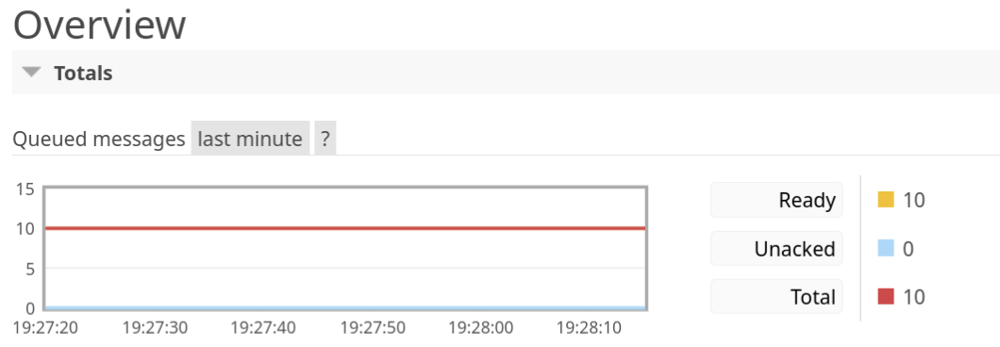
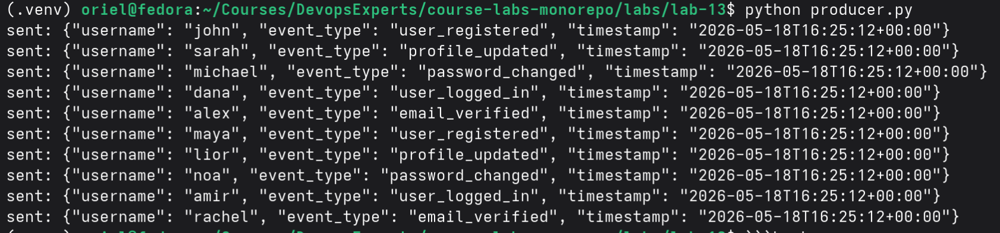
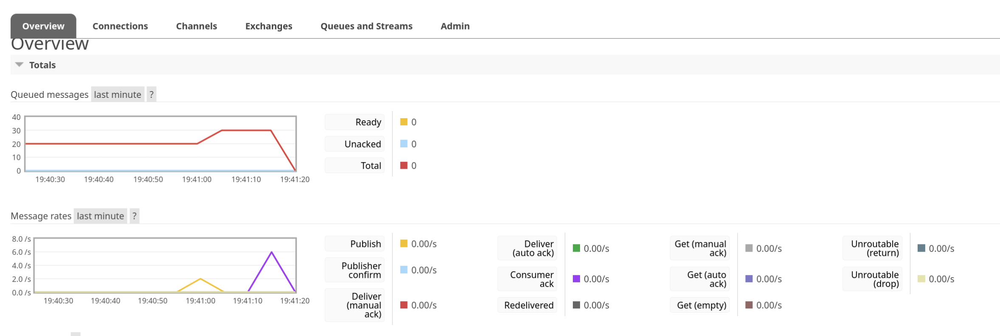

# Lab 13 — RabbitMQ Queue Systems: Producers, Consumers, and Message Flow

## Task 1 — Run RabbitMQ with Quadlet

### Step 1 — Install the Quadlet Unit

Run the commands from the course workspace:

```bash
cd course-labs-monorepo
mkdir -p ~/.config/containers/systemd
cp labs/lab-13/rabbitmq.container ~/.config/containers/systemd/rabbitmq.container
systemctl --user daemon-reload
```

### Step 2 — Start RabbitMQ

```bash
systemctl --user start rabbitmq.service
```

### Step 3 — Verify the Service

```bash
systemctl --user status rabbitmq.service
podman ps --filter name=rabbitmq
```

### Step 4 — Open RabbitMQ Management UI

Open the RabbitMQ Management UI:

```text
http://localhost:15672
```

## Task 2 — Create a Producer

### Step 1 — Create a Python Virtual Environment

Run the commands from the lab directory:

```bash
cd course-labs-monorepo/labs/lab-13
python3 -m venv .venv
source .venv/bin/activate
python -m pip install --upgrade pip
python -m pip install pika
```

### Step 2 — Review the Producer File

The producer file is located here:

```text
producer.py
```

Each message includes:

- `username`
- `event_type`
- `timestamp`

Example message:

```json
{
  "username": "john",
  "event_type": "user_registered",
  "timestamp": "2026-01-01T10:00:00"
}
```

### Step 3 — Send 10 Messages

```bash
cd course-labs-monorepo/labs/lab-13
source .venv/bin/activate
python producer.py
```

You should see the producer send 10 messages:



### Checkpoint — Producer Only

Run only the producer:

```bash
python producer.py
```

Answer:

- What do you see in the RabbitMQ dashboard?
- Where do the messages go?

Use the result from Step 3 as your reference:


## Task 3 — Create a Consumer

### Step 1 — Review the Consumer File

The consumer file is located here:

```text
consumer.py
```

The consumer listens to the `events` queue and prints each message in a readable format.

Example output:

```text
User john triggered user_registered at 10:00
```

### Step 2 — Consume Messages

```bash
cd course-labs-monorepo/labs/lab-13
source .venv/bin/activate
python consumer.py
```

You should see the consumer receive and print the messages:



### Checkpoint — Consuming Queued Messages

Answer:

- What happens to queued messages?
- Do they disappear instantly or gradually?

Queued messages are consumed gradually. In this lab, the consumer receives one message at a time, prints it, acknowledges it, and then moves to the next message.

### Step 3 — Observe Queue Activity

Open the RabbitMQ Management UI:

```text
http://localhost:15672
```

While the producer and consumer are running, observe:

- Messages in the queue
- Consumer activity
- Queue growth and draining
- Ready vs Unacked messages



## Task 4 — Publish a Message with the RabbitMQ HTTP API

### Step 1 — Publish with curl

Run this command from any terminal:

```bash
curl -u guest:guest \
  -H "content-type:application/json" \
  -X POST \
  -d '{
    "properties": {},
    "routing_key": "events",
    "payload": "Message sent via curl",
    "payload_encoding": "string"
  }' \
  http://127.0.0.1:15672/api/exchanges/%2F/amq.default/publish
```

This command uses the RabbitMQ Management HTTP API to publish a message through the default exchange.

The `events` queue must exist before you publish to it. In this lab, the producer and consumer both declare the queue automatically. If the response is `{"routed":false}`, run the producer or consumer once and then run the curl command again.

Expected response:

```json
{"routed":true}
```

The important fields are:

- `routing_key` — the queue name that should receive the message
- `payload` — the message content
- `payload_encoding` — tells RabbitMQ that the payload is plain text
