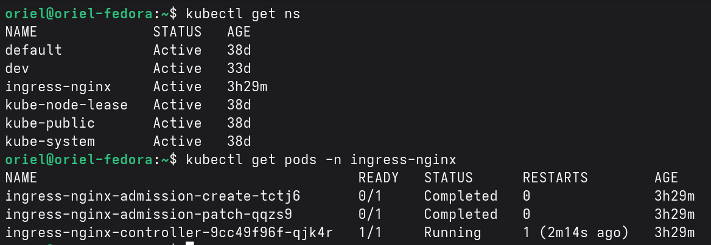
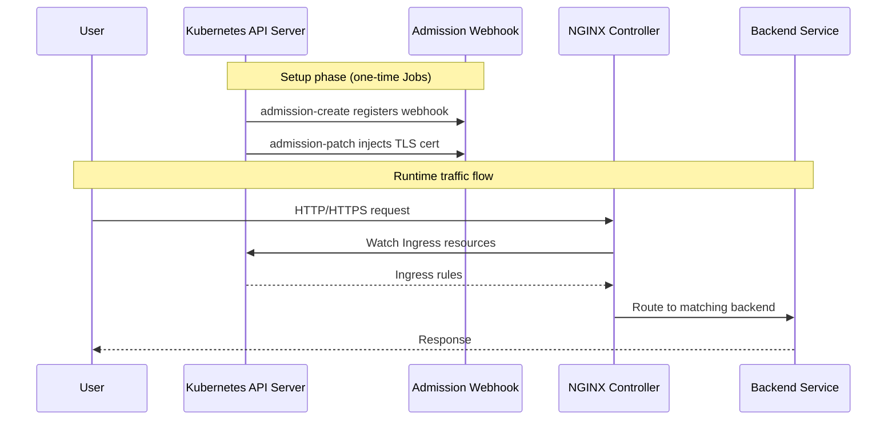
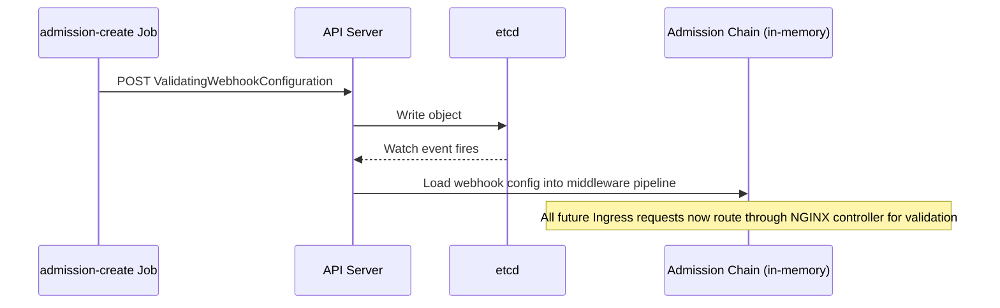
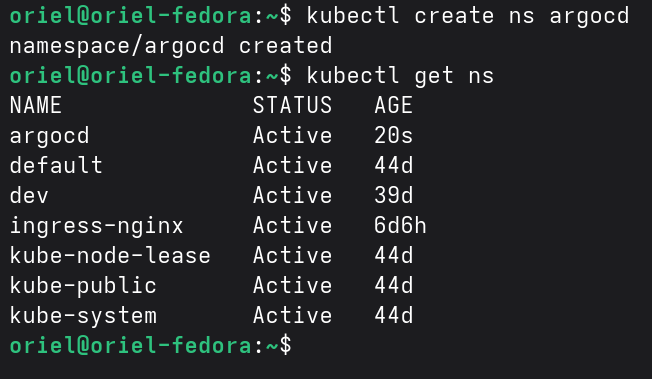
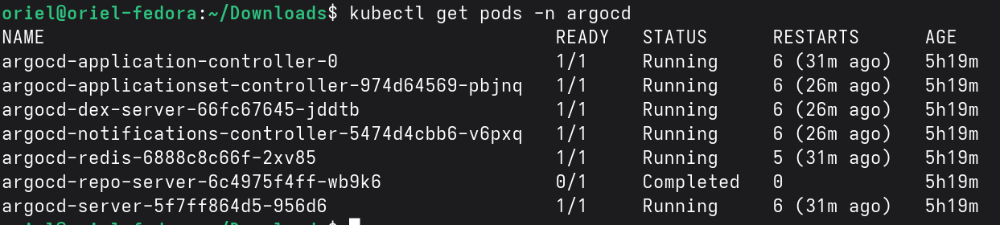
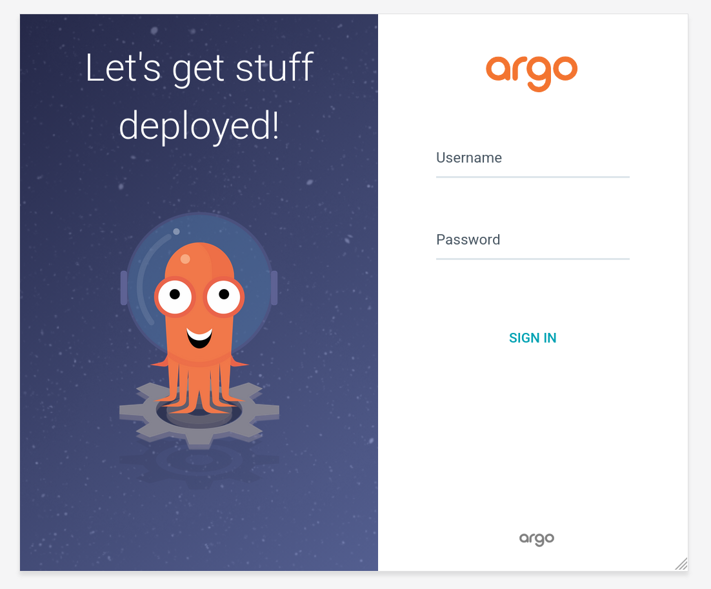
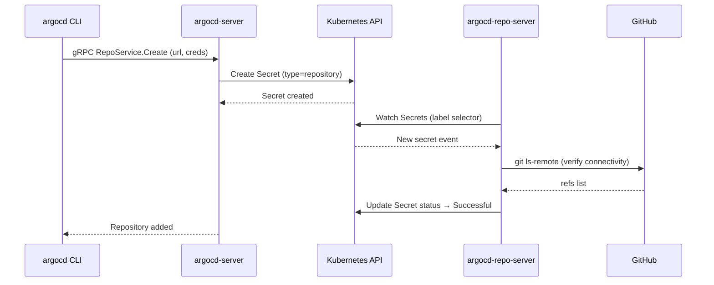
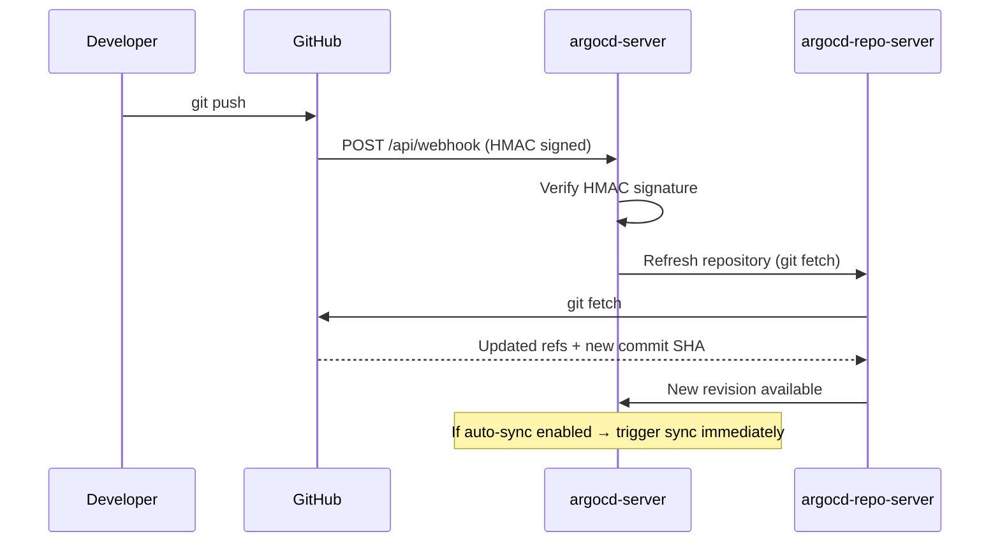
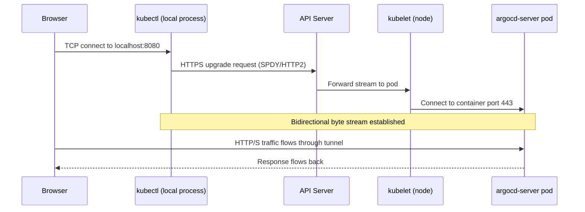
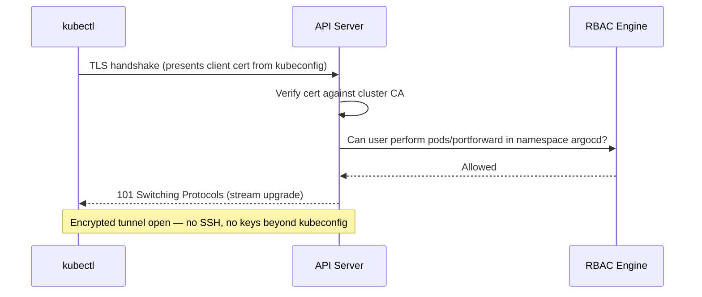

# Lab 8 — ArgoCD & GitOps

## Prerequisites

- A running Kubernetes cluster (Minikube used in this lab)
- `kubectl` configured and connected to the cluster

---

## Task 1 — Deploy Ingress Controller via Minikube Addon

### What is an Addon?

Minikube **addons** are pre-packaged Kubernetes components that can be enabled or disabled with a single command. They configure not just the Kubernetes manifests, but also the underlying infrastructure settings of the cluster (storage drivers, networking, DNS, etc.).

> Think of an addon as a **yaml manifest + infrastructure wiring**, bundled together and managed by Minikube itself.

#### Is an Addon like a Helm Chart?

They share the same goal (deploying a component with one command) but operate at different levels:

| | Addon | Helm Chart |
| --- | --- | --- |
| Scope | Minikube-specific | Any Kubernetes cluster |
| Configuration | Pre-baked, minimal options | Highly configurable via `values.yaml` |
| Infrastructure integration | Yes (e.g., sets up networking, storage) | No — only deploys manifests |
| Portability | Minikube only | Cloud, on-prem, local |
| Use case | Dev/local cluster tooling | Production-grade deployments |

**In production** you would deploy the NGINX Ingress Controller via its official Helm chart. In this lab we use the addon because we are working locally with Minikube and it handles the integration for us.

---

### Step 1 — Enable the Ingress Addon

```bash
minikube addons enable ingress
```

This command:

1. Pulls the NGINX Ingress Controller manifests
2. Creates the `ingress-nginx` namespace
3. Configures Minikube's network to route traffic through the controller

---

### Step 2 — Verify the Deployment

Check that the `ingress-nginx` namespace was created and all pods are in the expected state:

```bash
kubectl get ns
kubectl get pods -n ingress-nginx
```

#### Expected Output

```text
NAME                                        READY   STATUS      RESTARTS   AGE
ingress-nginx-admission-create-xxxxx        0/1     Completed   0          48s
ingress-nginx-admission-patch-xxxxx         0/1     Completed   0          48s
ingress-nginx-controller-xxxxxxxxxx-xxxxx   1/1     Running     0          48s
```



---

### Understanding the Three Pods

When the Ingress Controller is deployed, three pods are created. Each has a distinct role:

#### 1. `ingress-nginx-admission-create` — Status: Completed

This is a **one-time Job pod**. Its sole purpose is to create a `ValidatingWebhookConfiguration` resource in the cluster. This webhook tells the Kubernetes API server: *"Before accepting any new Ingress object, send it to the NGINX controller for validation first."*

Once the webhook resource is created, this pod's job is done — it exits with `Completed` and is never restarted.

#### 2. `ingress-nginx-admission-patch` — Status: Completed

Another **one-time Job pod**. After the webhook is created, this pod **patches it with the TLS certificate** of the Ingress Controller, so the API server can securely communicate with the webhook over HTTPS.

Without this step, the API server would reject the connection because it cannot verify the webhook's identity.

Like the create pod, it exits with `Completed` once its job is done.

#### 3. `ingress-nginx-controller` — Status: Running

This is the **actual Ingress Controller** — a long-running pod that stays alive for the lifetime of your cluster. It:

- Watches for `Ingress` resources across all namespaces
- Translates them into NGINX configuration (`nginx.conf`)
- Reloads NGINX when routes change
- Routes incoming HTTP/HTTPS traffic to the correct backend services



---

### Summary

| Pod | Type | Purpose | Final State |
| --- | --- | --- | --- |
| `admission-create` | Job | Register ValidatingWebhook | Completed |
| `admission-patch` | Job | Inject TLS cert into webhook | Completed |
| `controller` | Deployment | Route incoming traffic via NGINX | Running |

The two `Completed` pods are **not errors** — they are expected. They are bootstrap jobs that run once and finish. Only the controller needs to remain running.

---

## Deep Dive — How the Admission Webhook Actually Works

> This section is optional. It explains the internals behind what the two Job pods do, how the API server processes them, and what security implications this carries.

### Communication Flow: Pod → API Server → etcd

A common misconception is that pods write directly to etcd. They never do. **All communication goes through the API server.** etcd is only accessible by the API server itself.

```text
Pod  →  HTTPS  →  API Server  →  etcd
```

When `admission-create` runs, it sends an HTTP POST to the API server:

```http
POST /apis/admissionregistration.k8s.io/v1/validatingwebhookconfigurations
```

The API server validates the request, writes the `ValidatingWebhookConfiguration` object to etcd, then loads it into its own **in-memory admission chain** via an internal watch on etcd.



### What "patch" means in `admission-patch`

When the webhook is registered, the API server needs a TLS certificate to trust when it calls the NGINX controller. The `caBundle` field in the webhook config holds that CA certificate.

At creation time, `caBundle` is empty. The `admission-patch` job:

1. Reads the TLS cert generated for the NGINX controller
2. Calls `PATCH` on the webhook config to inject the CA cert into `caBundle`

Without this, the API server would reject the HTTPS call to the controller (untrusted certificate) and block all Ingress creation.

### Production Note — TLS and cert-manager

In this lab the NGINX controller uses a **self-signed certificate** — it generates its own CA and signs its own cert. This is acceptable locally but has risks in production:

- If the cert expires → all Ingress creation is blocked cluster-wide
- No automatic rotation
- No audit trail

In production, [**cert-manager**](https://cert-manager.io/) is the standard solution. It issues and automatically rotates certificates from a trusted CA (Let's Encrypt, HashiCorp Vault, internal PKI) and injects the `caBundle` into webhook configs automatically.

---

### Security — Preventing Malicious Webhook Injection

Creating a `ValidatingWebhookConfiguration` is powerful — it registers middleware that intercepts every matching API request. A malicious one could silently block or inspect traffic. The defense layers are:

| Layer | Mechanism | Purpose |
| --- | --- | --- |
| **Authentication** | Client certs, service account tokens, OIDC | Verifies identity before any request is processed |
| **RBAC** | `ClusterRole` + `ClusterRoleBinding` | Only `cluster-admin` can create webhook configs by default |
| **Built-in Admission** | API server schema validation | Rejects malformed webhook objects |
| **Policy Engine** | OPA / Kyverno | Custom rules — e.g., only allow webhooks pointing to internal URLs |
| **Audit Logging** | API server audit log | Detects and records every write to etcd |

> **Analogy:** This is the Kubernetes equivalent of SQL injection. Just as parameterized queries and least-privilege DB users prevent SQL injection, RBAC and policy engines prevent malicious object injection into etcd. The most dangerous variant is a **MutatingWebhookConfiguration** — an attacker who can create one can silently modify every pod spec being deployed (e.g., swap container images, inject environment variables).

---

## Task 2 — Install ArgoCD

Before installing ArgoCD, we need a dedicated namespace for all its components, then apply the official manifests.

> Reference: [ArgoCD Getting Started Guide](https://argo-cd.readthedocs.io/en/stable/getting_started/)

### Why a Separate Namespace?

ArgoCD deploys several components (API server, repo server, application controller, Redis, Dex, etc.). Placing them in their own namespace:

- **Isolates** ArgoCD resources from application workloads
- **Simplifies RBAC** — you can grant access to the ArgoCD namespace without exposing other namespaces
- **Makes cleanup easy** — deleting the namespace removes everything ArgoCD-related

---

### Step 1 — Create the Namespace

```bash
kubectl create namespace argocd
```

### Step 2 — Verify the Namespace

```bash
kubectl get ns argocd
```

#### Expected Output

```text
NAME     STATUS   AGE
argocd   Active   5s
```



---

### Step 3 — Apply the ArgoCD Manifests

```bash
kubectl apply -n argocd --server-side --force-conflicts -f https://raw.githubusercontent.com/argoproj/argo-cd/stable/manifests/install.yaml
```

#### Command Breakdown

| Argument | Explanation |
| --- | --- |
| `kubectl apply` | Declaratively applies a configuration to the cluster. It creates resources if they don't exist, or updates them to match the desired state |
| `-n argocd` | Targets the `argocd` namespace — all resources defined in the manifest will be created inside this namespace |
| `--server-side` | Uses **Server-Side Apply** instead of the default client-side apply. The API server itself manages field ownership and merges, which is more reliable for large manifests with many fields and avoids client-side merge conflicts |
| `--force-conflicts` | If another field manager (e.g., a previous `kubectl apply`) owns a field that this apply wants to change, force the update instead of failing with a conflict error. This is especially useful when re-applying or upgrading ArgoCD |
| `-f <url>` | Specifies the manifest source. Here it points to the raw YAML file hosted on GitHub under the `stable` branch of the ArgoCD repository. This single file contains all the CRDs, Deployments, Services, ConfigMaps, RBAC rules, and other resources ArgoCD needs |

> **Note:** The ArgoCD installation manifest is large and complex. Client-side apply can struggle with annotation size limits (`kubectl.kubernetes.io/last-applied-configuration`) and field ownership conflicts during upgrades. Server-side apply with `--force-conflicts` avoids both issues cleanly.

---

### Step 4 — Verify the Installation

Check that all ArgoCD pods are running in the `argocd` namespace:

```bash
kubectl get pods -n argocd
```

You should see several pods — the core ArgoCD components:

| Pod | Role |
| --- | --- |
| `argocd-server` | The API & UI server — serves the web dashboard and handles API requests |
| `argocd-repo-server` | Clones Git repositories, renders manifests (Helm, Kustomize, plain YAML) |
| `argocd-application-controller` | The core reconciliation loop — compares desired state (Git) with live state (cluster) and syncs |
| `argocd-applicationset-controller` | Manages `ApplicationSet` resources for templating multiple Applications |
| `argocd-redis` | In-memory cache used by the server and controller for performance |
| `argocd-dex-server` | Handles SSO/OIDC authentication (identity provider integration) |
| `argocd-notifications-controller` | Sends notifications (Slack, email, webhooks) on sync events |



---

## Task 3 — Access the ArgoCD UI

With ArgoCD installed, we need to expose its server to access the web dashboard. There are two approaches depending on the environment.

### Port-Forward vs Ingress / Load Balancer

| | Port-Forward | Ingress / Load Balancer |
| --- | --- | --- |
| **How it works** | Creates a temporary tunnel from your local machine directly to a pod/service via the kubectl proxy | Exposes the service through a stable external endpoint (hostname or IP) |
| **Persistence** | Lives only as long as the terminal session running the command | Permanent — survives pod restarts, kubectl sessions, reboots |
| **Discoverability** | Only accessible from the machine running the command | Accessible to anyone with network access to the endpoint |
| **TLS / Certificates** | Tunnels raw traffic — TLS is handled by the destination service | Full TLS termination at the Ingress or LB layer with proper certs |
| **Use case** | Local development, debugging, one-off access | Production, shared access, always-on services |
| **Setup complexity** | Zero — one command | Requires Ingress controller, DNS record, and TLS certificate |

> **Production Note:** In production you would expose ArgoCD via an Ingress resource (pointing to the Ingress controller we deployed in Task 1) or a cloud Load Balancer, with a real DNS name and a TLS certificate managed by cert-manager. In this lab we are running locally on Minikube, so `kubectl port-forward` is the fastest and simplest option — no DNS, no certificates, no external IP needed.

---

### Step 1 — Port-Forward the ArgoCD Server

```bash
kubectl port-forward svc/argocd-server -n argocd 8080:443
```

#### Command Breakdown

| Part | Explanation |
| --- | --- |
| `kubectl port-forward` | Opens a tunnel between your local machine and a resource inside the cluster |
| `svc/argocd-server` | Targets the `argocd-server` **Service** (not just a single pod) — kubectl will pick one of the backing pods automatically |
| `-n argocd` | Specifies the namespace where the service lives |
| `8080:443` | Maps **local port 8080** → **service port 443**. ArgoCD's server listens on HTTPS (443); we access it locally on 8080 to avoid requiring root privileges |

> Keep this terminal open. The tunnel stays alive only while the command is running.

---

### Step 2 — Open the Dashboard

Navigate to:

```text
https://localhost:8080
```

Your browser will show a certificate warning because ArgoCD uses a self-signed certificate by default. Accept the warning to proceed.



---

### Step 3 — Retrieve the Initial Admin Password

ArgoCD generates a random initial password for the `admin` user and stores it in a Kubernetes Secret. Retrieve it with:

```bash
kubectl get secret argocd-initial-admin-secret -n argocd \
  -o jsonpath="{.data.password}" | base64 --decode && echo
```

Log in with:

- **Username:** `admin`
- **Password:** the value printed above

> **Note:** Change this password immediately after first login and delete the `argocd-initial-admin-secret` Secret — ArgoCD does not need it after the initial setup.

---

### Why Kubernetes Secrets Are Not Actually Secret

The command above reveals a fundamental problem: the password is stored as a Kubernetes Secret, but Kubernetes Secrets are **not encrypted by default**. They are only **base64-encoded**.

Base64 is an encoding format, not encryption. Anyone who can run `kubectl get secret` can decode the value in seconds:

```bash
echo "dGhpcyBpcyBub3QgZW5jcnlwdGVk" | base64 --decode
# this is not encrypted
```

In practice this means:

| Where secrets live | What "protection" exists | Who can read them |
| --- | --- | --- |
| etcd (on disk) | None by default — stored as base64 plaintext | Anyone with etcd access |
| Kubernetes API | RBAC controls `get`/`list` on Secret objects | Any user/pod with the right role |
| Pod environment | Injected as env vars or mounted files | Any process inside the pod |
| `git` (if committed) | None | Anyone with repo access |

> **Warning:** Never commit Secrets to Git — even base64-encoded values are trivially reversible. Tools like `git-secrets` or `gitleaks` can scan for accidental commits.

#### What You Can Do

There are several layers of mitigation, each addressing a different part of the problem:

| Approach | What it solves | Limitation |
| --- | --- | --- |
| **RBAC** | Restricts who can read Secrets via the API | Does not protect etcd-level access |
| **etcd encryption at rest** | Encrypts Secret data in etcd using an AES key | The AES key itself must be stored somewhere |
| **Sealed Secrets** | Encrypts the Secret before it enters the cluster (safe to commit) | Cluster-specific — key lives in the cluster |
| **External Secrets Operator (ESO) + Vault / OpenBao** | Secrets never live in Kubernetes at all — fetched at runtime from a dedicated secrets store | Requires external infrastructure |

The gold standard is the last approach: keep secrets entirely outside the cluster in a dedicated secrets manager, and inject them into pods only at runtime. This lab series implements that using **OpenBao** (the open-source continuation of HashiCorp Vault) as the secrets backend, connected to the cluster via the External Secrets Operator.

> **Note:** The OpenBao + ESO setup — including a Docker Compose file to run OpenBao alongside Minikube — is covered in a dedicated lab. That lab also migrates the ArgoCD admin secret away from a Kubernetes Secret entirely.

---

## Task 4 — Prepare the Helm Chart Repository

With ArgoCD running and accessible, we now prepare the repository it will deploy from. Before ArgoCD can track a repo, the repo must exist — with the right branches, values files, and chart layout.

By the end of this task you will have cloned the Helm chart repo, understood its structure, and created the `dev` branch that ArgoCD will watch in the next tasks.

### What You Are Building

A Helm chart monorepo (`helm-gitops-demo`) holds an nginx chart with environment-specific values files. Two long-lived branches represent two environments:

| Branch | Values file | Replicas | Environment |
| --- | --- | --- | --- |
| `main` | `values-prod.yaml` | 3 | Production |
| `dev` | `values-dev.yaml` | 1 | Development |

ArgoCD will later deploy both as separate Applications, each watching its own branch. For now, you are setting up the Git side — the source of truth.

---

### Step 1 — Clone the Helm Chart Repo

```bash
git clone https://github.com/DevOps-Course-2026/helm-gitops-demo.git
cd helm-gitops-demo
```

### Step 2 — Understand the Chart Structure

The chart was generated with `helm create myapp` — the default Helm scaffold — and uses nginx as the application image.

```text
charts/myapp/
  Chart.yaml          ← chart metadata (name, version, appVersion)
  values.yaml         ← default values
  values-dev.yaml     ← dev overrides (1 replica)
  values-prod.yaml    ← prod overrides (3 replicas)
  templates/          ← Kubernetes manifest templates
```

Inspect the environment overrides:

```bash
cat charts/myapp/values-dev.yaml
```

```yaml
replicaCount: 1

image:
  repository: nginx
  tag: "1.25"

service:
  type: ClusterIP
  port: 80
```

```bash
cat charts/myapp/values-prod.yaml
```

```yaml
replicaCount: 3

image:
  repository: nginx
  tag: "1.25"

service:
  type: ClusterIP
  port: 80
```

The only difference is `replicaCount` — 1 for dev, 3 for prod. This is the simplest expression of environment promotion via values files.

### Step 3 — Create and Push the `dev` Branch

```bash
git checkout -b dev
git push origin dev
```

The repo now has two long-lived branches. ArgoCD will target each independently in the next tasks.

---

### Summary

| What | Why |
| --- | --- |
| Cloned `helm-gitops-demo` | The Git source of truth for both environments |
| Reviewed chart structure | Values files control environment-specific config — no separate repos needed |
| Created and pushed `dev` branch | ArgoCD tracks branches per environment — `dev` for development, `main` for production |

The repository is ready. In the next task, you will register it with ArgoCD so it can start pulling from it.

---

## Task 5 — Connect GitHub to ArgoCD

### How the Pieces Fit Together

Before diving into steps, it helps to understand the full picture — from a Helm chart in Git all the way to running pods in the cluster.

#### The Full Stack

| Layer | What it is | Example in this lab |
| --- | --- | --- |
| **Helm chart** | A template for Kubernetes manifests — parameterised with `values.yaml` | `charts/myapp/` in `helm-gitops-demo` |
| **Values file** | Overrides for a specific environment — replicas, image tag, resource limits | `values-dev.yaml`, `values-prod.yaml` |
| **Git repository** | Holds the chart and all values files. The source of truth | `helm-gitops-demo` on GitHub |
| **Repository registration** | A record in ArgoCD: "this Git URL exists, here is how to reach it" | Stored as a Kubernetes Secret in `argocd` namespace |
| **ArgoCD Application** | Tells ArgoCD: "watch *this repo*, at *this branch*, render *this chart* with *this values file*, deploy into *this namespace*" | `myapp-dev`, `myapp-prod` |
| **Kubernetes Deployment** | The actual running workload — created and kept in sync by ArgoCD | `myapp` pods in `myapp-dev` / `myapp-prod` |

#### How They Connect

```text
Helm chart + values file
        ↓  (rendered by ArgoCD repo-server)
Kubernetes manifests (Deployment, Service, Ingress…)
        ↓  (applied by ArgoCD application-controller)
Live Kubernetes resources
```

ArgoCD's job is to continuously compare what is in Git (the chart rendered with the values file) against what is live in the cluster, and reconcile any drift.

Each **ArgoCD Application** is the glue — it binds one branch of the repo, one path (the chart), and one values file override to one target namespace:

```text
helm-gitops-demo (repo)
  ├── branch: main  →  Application: myapp-prod  →  values-prod.yaml  →  namespace: myapp-prod  →  3 replicas
  └── branch: dev   →  Application: myapp-dev   →  values-dev.yaml   →  namespace: myapp-dev   →  1 replica
```

This is why you need **two Applications for two environments** — not two repos, not two charts. One chart, two values files, two branches, two Applications.

#### ArgoCD Application = Helm Release (managed by ArgoCD)

If you have used Helm directly before, an ArgoCD Application is conceptually the same thing as a **Helm release** — it is one instantiation of a chart with a specific set of values, deployed into a specific namespace.

The difference is **who manages the lifecycle**:

| | Plain Helm | ArgoCD Application |
| --- | --- | --- |
| Renders the chart | `helm install` / `helm upgrade` | ArgoCD repo-server (calls Helm internally) |
| Applies manifests to cluster | Helm | ArgoCD application-controller |
| Tracks desired state | Helm release Secret in cluster | Git (the branch/path in the Application spec) |
| Detects drift | Manual (`helm diff`) | Continuous — ArgoCD reconciles every 3 minutes |
| Rolls back | `helm rollback` | Revert the Git commit — ArgoCD syncs automatically |

When you create an ArgoCD Application pointing at a Helm chart, ArgoCD runs `helm template` under the hood to render the manifests, then applies them itself. Helm's own release tracking (`helm list`, `helm history`) is **not** used — ArgoCD replaces that layer entirely.

#### The Dependency Chain

```text
Git Repository → (registered in ArgoCD) → ArgoCD Application → Kubernetes Deployment
```

ArgoCD cannot create an Application pointing at a repo it has never seen. It needs to know the repo exists and how to reach it first. That is what "registering" means — telling ArgoCD about a Git URL before you ask it to deploy from it.

For **public repositories**, registration is purely about discoverability — no credentials needed, anonymous HTTPS is sufficient. For **private repositories**, registration is also where you supply credentials (token or SSH key), which ArgoCD stores in a Kubernetes Secret and reuses on every sync.

### Explicit vs Implicit Registration

ArgoCD can register a repo in two ways:

- **Implicitly** — when you create an Application pointing at a URL, ArgoCD registers the repo automatically the first time it syncs. This is convenient but skips any upfront connectivity check.
- **Explicitly** — you register the repo first via the CLI or UI, verify the connection status is `Successful`, and *then* create Applications against it. This is better for catching problems (wrong URL, missing credentials, network issues) before any deployment is attempted.

In this task you register explicitly.

---

### Step 1 — Install the ArgoCD CLI

> **Installation:** Follow the official guide at [argo-cd.readthedocs.io/en/stable/cli_installation](https://argo-cd.readthedocs.io/en/stable/cli_installation/) to install the `argocd` binary for your OS.

---

### Step 2 — Log In to ArgoCD

```bash
argocd login localhost:8080 --username admin --password <password>
```

#### Expected Output

```text
WARNING: server certificate had error: error creating connection: tls: failed to verify certificate: x509: certificate signed by unknown authority. Proceed insecurely (y/n)? y
'admin:login' logged in successfully
Context 'localhost:8080' updated
```

The CLI warns about the self-signed certificate — this is expected. Enter `y` to proceed.

---

### Step 3 — Register the Repository

```bash
argocd repo add https://github.com/DevOps-Course-2026/helm-gitops-demo.git
```

#### Expected Output

```text
Repository 'https://github.com/DevOps-Course-2026/helm-gitops-demo.git' added
```

Verify it is registered:

```bash
argocd repo list
```

```text
TYPE  NAME  REPO                                                               INSECURE  OCI    LFS    CREDS  STATUS      MESSAGE
git         https://github.com/DevOps-Course-2026/helm-gitops-demo.git         false     false  false  false  Successful
```

| Column | Meaning |
| --- | --- |
| `TYPE` | Protocol — `git` (standard Git over HTTPS or SSH) or `helm` (Helm registry) |
| `NAME` | Optional friendly name given to the repo — blank if `--name` was not used |
| `REPO` | The URL ArgoCD uses to clone/fetch from |
| `INSECURE` | `true` if TLS verification is disabled for this repo (e.g., self-signed cert on the Git server itself — different from the ArgoCD UI cert issue) |
| `OCI` | `true` if this is an OCI-based Helm registry (images stored in a container registry instead of a standard Helm repo) |
| `LFS` | `true` if Git LFS (Large File Storage) is enabled — used when the repo stores large binary assets via LFS pointers |
| `CREDS` | `true` if credentials (token or SSH key) are stored for this repo — `false` means anonymous access |
| `STATUS` | `Successful` = ArgoCD verified it can reach and clone the repo. `Failed` = connectivity or auth problem |
| `MESSAGE` | Empty on success; contains the error message if `STATUS` is `Failed` |

---

### Step 4 — UI Equivalent

In the ArgoCD UI: **Settings → Repositories → Connect Repo**.

| Field | Value |
| --- | --- |
| Connection method | `HTTPS` |
| Repository URL | `https://github.com/DevOps-Course-2026/helm-gitops-demo` |
| Username | *(leave blank)* |
| Password | *(leave blank)* |

Click **Connect**. The result is identical to the CLI command above.

---

### Private Repository — How It Differs

For a private repository you must supply credentials. The only change is adding flags to the CLI command (or filling in the credentials fields in the UI):

```bash
# Using a GitHub Personal Access Token
argocd repo add https://github.com/your-org/private-repo \
  --username git \
  --password <github-pat>

# Using an SSH key
argocd repo add git@github.com:your-org/private-repo \
  --ssh-private-key-path ~/.ssh/id_rsa
```

ArgoCD stores the credentials in a Kubernetes Secret in the `argocd` namespace:

```bash
kubectl get secrets -n argocd -l argocd.argoproj.io/secret-type=repository
```

The secret contains the URL, username, and password (or SSH key) — base64-encoded in etcd. The credentials only need to be supplied once.

> **Production Note:** Instead of personal tokens, production teams use a **GitHub App** or a **deploy key** scoped to exactly the repositories ArgoCD needs. This limits blast radius if credentials are ever rotated or leaked.

---

### Deep Dive — What Happens Internally When You Add a Repo

#### What is gRPC?

**gRPC** (Google Remote Procedure Call) is a protocol for calling functions on a remote server as if they were local functions. Instead of sending HTTP requests with JSON bodies, the caller says "run this function with these arguments" — the framework handles serialisation, transport, and response parsing.

ArgoCD uses gRPC for all communication between the CLI, the server, and internal components. It runs over HTTP/2, which allows multiple calls to share a single TCP connection and supports bidirectional streaming (used for features like `argocd app logs`).

REST APIs use URLs and HTTP verbs (`GET /repos`, `POST /repos`). gRPC uses service definitions (`RepoService.Create`, `RepoService.List`) — the same idea, different wire format.

---

When you run `argocd repo add`, the flow is:

1. The ArgoCD CLI sends a gRPC request to `argocd-server`
2. `argocd-server` writes a Kubernetes Secret to the `argocd` namespace with:
   - `argocd.argoproj.io/secret-type: repository` label
   - The URL, connection type (https/ssh), and any credentials
3. `argocd-repo-server` — a separate pod — picks up the new repository
4. `argocd-repo-server` performs an initial **`git ls-remote`** to verify connectivity and resolve the default branch
5. The result is stored as the repository's connection status (`Successful` or `Failed`)

From that point on, `argocd-repo-server` is the only component that touches Git. It runs `git fetch` on a schedule (every 3 minutes by default) and caches the result. `argocd-application-controller` reads the cached manifests and compares them to the live cluster state — it never talks to Git directly.



The separation between `argocd-server` (API) and `argocd-repo-server` (Git operations) means that credentials are only ever used by `argocd-repo-server`, which has no public-facing port. Even if `argocd-server` were compromised, an attacker could not directly use stored credentials — they would have to pivot through `argocd-repo-server` inside the cluster.

#### Polling vs Webhooks

By default, ArgoCD discovers changes through **polling** — `argocd-repo-server` runs `git fetch` on a fixed interval (3 minutes by default). Every registered repository is checked on that schedule, regardless of whether anything changed.

**Webhooks** invert the model: instead of ArgoCD asking "did anything change?", GitHub tells ArgoCD "something just changed" the moment a `git push` lands. ArgoCD refreshes only the affected repository immediately, cutting the delay from up to 3 minutes to seconds.

| | Polling | Webhook |
| --- | --- | --- |
| **Direction** | ArgoCD pulls from GitHub | GitHub pushes to ArgoCD |
| **Lag after `git push`** | Up to 3 minutes | Seconds |
| **Setup** | Zero — works out of the box | Requires a public ArgoCD endpoint + webhook config |
| **Works in local / Minikube** | Yes | No — GitHub cannot reach `localhost` |
| **Scalability** | Every repo polled on the same schedule | Only triggered repos refresh |

For local development with Minikube, polling is fine. In production, webhooks are strongly recommended.

##### Enabling Webhooks in Production

Two parts: configure GitHub to send the event, and configure ArgoCD to verify it.

**1. Add a webhook on GitHub** — in your repository under **Settings → Webhooks → Add webhook**:

| Field | Value |
| --- | --- |
| Payload URL | `https://<argocd-hostname>/api/webhook` |
| Content type | `application/json` |
| Secret | A random string — e.g., `openssl rand -hex 20` |
| Events | Just the push event |

**2. Store the secret in ArgoCD** so it can verify the HMAC signature GitHub attaches to every payload:

```bash
kubectl patch secret argocd-secret -n argocd \
  --type='json' \
  -p='[{"op":"add","path":"/data/webhook.github.secret","value":"'$(echo -n "<your-secret>" | base64)'"}]'
```

Requests without a valid signature are rejected, preventing spoofed pushes from triggering syncs.

> **Note:** The webhook only accelerates *detection* of changes. ArgoCD still goes through its normal sync flow — Helm render, diff, apply. If auto-sync is disabled, the webhook triggers a refresh (ArgoCD knows a new commit exists) but waits for manual sync approval before touching the cluster.



---

### Summary

| Step | What happened | Why it matters |
| --- | --- | --- |
| Install CLI | Installed `argocd` locally | Needed to interact with the ArgoCD API from your terminal |
| `argocd login` | Authenticated; accepted self-signed cert interactively | Credentials stored in `~/.config/argocd/config` for subsequent commands |
| `argocd repo add` | Registered the public repo | ArgoCD can now pull Helm charts from `helm-gitops-demo` |
| `CREDS: false` | No credentials stored | The repo is public — anonymous HTTPS is sufficient |

In the next task, you will create the first ArgoCD Application and point it at the `dev` branch.

---

## Deep Dive — How `kubectl port-forward` Works

> This section is optional. It covers the internals of the port-forward tunnel — how it is established, why it is tied to your terminal, and how it is secured without SSH keys.

### The Tunnel Path

When you run `kubectl port-forward`, no SSH is involved. Instead, kubectl reuses the **existing authenticated HTTPS connection** to the Kubernetes API server. The actual data path is:

```text
Browser → localhost:8080 → kubectl (local proxy) → HTTPS → API Server → kubelet → container port 443
```



The API server acts as a **relay** — it does not inspect the tunnelled traffic, it just forwards raw bytes between kubectl and the kubelet on the node where the pod is running.

---

### Why the Terminal Must Stay Open

`kubectl port-forward` is a **long-running foreground process**. It:

1. Opens a local TCP listener on `127.0.0.1:8080`
2. For every incoming connection, upgrades the API server connection to a streaming channel (SPDY or HTTP/2)
3. Copies bytes bidirectionally between the local socket and the remote pod

When you close the terminal (or press `Ctrl+C`), the local listener is torn down and the API server closes the upstream stream. The pod itself is unaffected — only future connections to `localhost:8080` will fail.

---

### Security — Why Only You Can Access It

By default, `kubectl port-forward` binds to `127.0.0.1` (loopback interface only). This means:

- Only processes running on **your local machine** can connect to port 8080
- Nothing on your network (other machines, VMs, containers) can reach it
- No firewall rule or DNS entry is created

> **Note:** If you explicitly pass `--address 0.0.0.0`, the listener binds to all interfaces and becomes reachable from the network. Never do this in a shared or untrusted environment.

---

### Is It SSH? Where Are the Keys?

No — `kubectl port-forward` is **not SSH**. There is no SSH daemon running, no SSH keys, no `authorized_keys` file.

Authentication is handled entirely by your **kubeconfig** file (`~/.kube/config`). The kubeconfig contains one of:

| Auth method | What it looks like in kubeconfig | How it proves identity |
| --- | --- | --- |
| **Client certificate** | `client-certificate-data` + `client-key-data` | TLS mutual auth — your cert was signed by the cluster CA |
| **Bearer token** | `token` | A service account or user token issued by the API server |
| **OIDC** | `exec` plugin | kubectl calls an external binary to fetch a short-lived token |

For Minikube, the default is a **client certificate** — Minikube generates a CA, signs a cert for your user, and writes both the cert and key into `~/.kube/config` automatically when you run `minikube start`.

When kubectl makes the HTTPS connection to the API server, it presents this client certificate. The API server verifies it against its CA, then checks RBAC to confirm your user has permission to use `pods/portforward`. If both checks pass, the tunnel is opened.



### Comparison: `kubectl port-forward` vs SSH Tunneling

| | `kubectl port-forward` | SSH tunnel (`ssh -L`) |
| --- | --- | --- |
| **Protocol** | HTTPS + SPDY/HTTP2 stream upgrade | SSH (TCP port 22) |
| **Auth** | kubeconfig (client cert or token) | SSH key pair or password |
| **Requires SSH daemon** | No | Yes — `sshd` must be running on the remote host |
| **Bound to localhost** | Yes (by default) | Yes (by default) |
| **Traffic encrypted** | Yes — TLS to API server | Yes — SSH encryption |
| **Scope** | Pod/service port inside a cluster | Any port on any SSH-accessible host |
