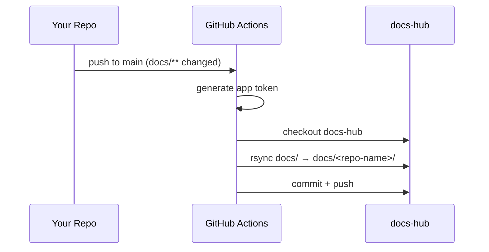

# 📦 Template Guide

The [`devops-template`](https://github.com/DevOps-Course-2026/devops-template)
is the golden-path starting point for every repository in the
**DevOps Course 2026** organisation. It ships with docs sync, lint CI, and
Copilot style instructions pre-wired.

## What the Template Ships

| File | Purpose |
| --- | --- |
| `.github/workflows/sync-docs.yml` | Syncs `docs/**` to this portal on every push to `main` |
| `.github/workflows/lint-docs.yml` | Runs `markdownlint-cli2` on every `.md` change |
| `.github/copilot-instructions.md` | Injects markdown style rules into every Copilot request |
| `.markdownlint.yaml` | Markdownlint rule configuration |
| `.markdownlint-cli2.yaml` | Excludes `node_modules`, `build`, `dist` from lint scans |
| `docs/README.md` | Placeholder — replace with your own docs |
| `README.md` | Repo overview stub |

## Creating a Repo From the Template

1. Open [devops-template](https://github.com/DevOps-Course-2026/devops-template).
2. Click **Use this template → Create a new repository**.
3. Set the owner to `DevOps-Course-2026` and name the repo.
4. Add the required secrets (see below).
5. Replace `README.md` and `docs/README.md` with your own content.

## Required Secrets

Add these in **Settings → Secrets and variables → Actions** of your new repo:

| Secret | Description |
| --- | --- |
| `DOCS_HUB_SYNC_APP_ID` | App ID of the `docs-hub-sync` GitHub App |
| `DOCS_HUB_SYNC_APP_PRIVATE_KEY` | Private key of the `docs-hub-sync` GitHub App |

:::note
Ask the org admin for the secret values — they are shared across all repos in
the organisation.
:::

## How Docs Sync Works

When you push a change to any file under `docs/` on `main`, the sync workflow:

1. Checks out your repo.
2. Generates a short-lived token via the `docs-hub-sync` GitHub App.
3. Checks out `docs-hub`.
4. Copies your `docs/` into `docs-hub/docs/<your-repo-name>/`.
5. Commits and pushes — triggering a Docusaurus rebuild.



## Lint CI

The lint workflow runs `markdownlint-cli2` on every `.md` change. Fix all
errors locally before pushing:

```bash
markdownlint-cli2 "**/*.md" 2>&1 | grep -E "^\S.*:.*error|^Summary"
```

Zero errors required before merging.
