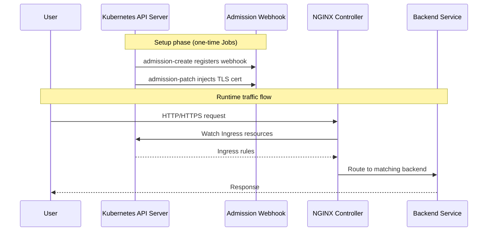
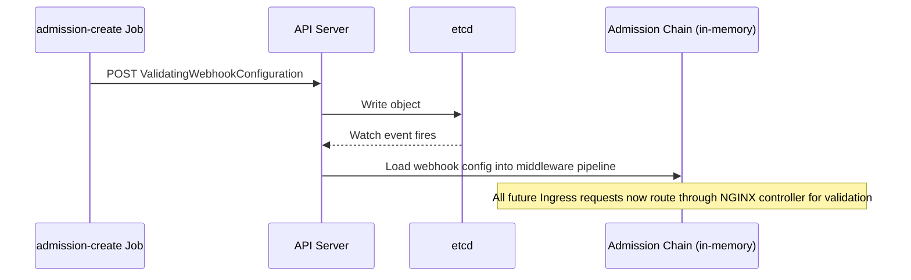

# Lab 8 — ArgoCD & GitOps

## Prerequisites

- A running Kubernetes cluster (Minikube used in this lab)
- `kubectl` configured and connected to the cluster

---

## Task 1 — Deploy Ingress Controller via Minikube Addon

### What is an Addon?

Minikube **addons** are pre-packaged Kubernetes components that can be enabled or disabled with a single command. They configure not just the Kubernetes manifests, but also the underlying infrastructure settings of the cluster (storage drivers, networking, DNS, etc.).

> Think of an addon as a **yaml manifest + infrastructure wiring**, bundled together and managed by Minikube itself.

#### Is an Addon like a Helm Chart?

They share the same goal (deploying a component with one command) but operate at different levels:

| | Addon | Helm Chart |
| --- | --- | --- |
| Scope | Minikube-specific | Any Kubernetes cluster |
| Configuration | Pre-baked, minimal options | Highly configurable via `values.yaml` |
| Infrastructure integration | Yes (e.g., sets up networking, storage) | No — only deploys manifests |
| Portability | Minikube only | Cloud, on-prem, local |
| Use case | Dev/local cluster tooling | Production-grade deployments |

**In production** you would deploy the NGINX Ingress Controller via its official Helm chart. In this lab we use the addon because we are working locally with Minikube and it handles the integration for us.

---

### Step 1 — Enable the Ingress Addon

```bash
minikube addons enable ingress
```

This command:

1. Pulls the NGINX Ingress Controller manifests
2. Creates the `ingress-nginx` namespace
3. Configures Minikube's network to route traffic through the controller

---

### Step 2 — Verify the Deployment

Check that the `ingress-nginx` namespace was created and all pods are in the expected state:

```bash
kubectl get ns
kubectl get pods -n ingress-nginx
```

#### Expected Output

```text
NAME                                        READY   STATUS      RESTARTS   AGE
ingress-nginx-admission-create-xxxxx        0/1     Completed   0          48s
ingress-nginx-admission-patch-xxxxx         0/1     Completed   0          48s
ingress-nginx-controller-xxxxxxxxxx-xxxxx   1/1     Running     0          48s
```


---

### Understanding the Three Pods

When the Ingress Controller is deployed, three pods are created. Each has a distinct role:

#### 1. `ingress-nginx-admission-create` — Status: Completed

This is a **one-time Job pod**. Its sole purpose is to create a `ValidatingWebhookConfiguration` resource in the cluster. This webhook tells the Kubernetes API server: *"Before accepting any new Ingress object, send it to the NGINX controller for validation first."*

Once the webhook resource is created, this pod's job is done — it exits with `Completed` and is never restarted.

#### 2. `ingress-nginx-admission-patch` — Status: Completed

Another **one-time Job pod**. After the webhook is created, this pod **patches it with the TLS certificate** of the Ingress Controller, so the API server can securely communicate with the webhook over HTTPS.

Without this step, the API server would reject the connection because it cannot verify the webhook's identity.

Like the create pod, it exits with `Completed` once its job is done.

#### 3. `ingress-nginx-controller` — Status: Running

This is the **actual Ingress Controller** — a long-running pod that stays alive for the lifetime of your cluster. It:

- Watches for `Ingress` resources across all namespaces
- Translates them into NGINX configuration (`nginx.conf`)
- Reloads NGINX when routes change
- Routes incoming HTTP/HTTPS traffic to the correct backend services



---

### Summary

| Pod | Type | Purpose | Final State |
| --- | --- | --- | --- |
| `admission-create` | Job | Register ValidatingWebhook | Completed |
| `admission-patch` | Job | Inject TLS cert into webhook | Completed |
| `controller` | Deployment | Route incoming traffic via NGINX | Running |

The two `Completed` pods are **not errors** — they are expected. They are bootstrap jobs that run once and finish. Only the controller needs to remain running.

---

## Deep Dive — How the Admission Webhook Actually Works

> This section is optional. It explains the internals behind what the two Job pods do, how the API server processes them, and what security implications this carries.

### Communication Flow: Pod → API Server → etcd

A common misconception is that pods write directly to etcd. They never do. **All communication goes through the API server.** etcd is only accessible by the API server itself.

```text
Pod  →  HTTPS  →  API Server  →  etcd
```

When `admission-create` runs, it sends an HTTP POST to the API server:

```http
POST /apis/admissionregistration.k8s.io/v1/validatingwebhookconfigurations
```

The API server validates the request, writes the `ValidatingWebhookConfiguration` object to etcd, then loads it into its own **in-memory admission chain** via an internal watch on etcd.



### What "patch" means in `admission-patch`

When the webhook is registered, the API server needs a TLS certificate to trust when it calls the NGINX controller. The `caBundle` field in the webhook config holds that CA certificate.

At creation time, `caBundle` is empty. The `admission-patch` job:

1. Reads the TLS cert generated for the NGINX controller
2. Calls `PATCH` on the webhook config to inject the CA cert into `caBundle`

Without this, the API server would reject the HTTPS call to the controller (untrusted certificate) and block all Ingress creation.

### Production Note — TLS and cert-manager

In this lab the NGINX controller uses a **self-signed certificate** — it generates its own CA and signs its own cert. This is acceptable locally but has risks in production:

- If the cert expires → all Ingress creation is blocked cluster-wide
- No automatic rotation
- No audit trail

In production, [**cert-manager**](https://cert-manager.io/) is the standard solution. It issues and automatically rotates certificates from a trusted CA (Let's Encrypt, HashiCorp Vault, internal PKI) and injects the `caBundle` into webhook configs automatically.

---

### Security — Preventing Malicious Webhook Injection

Creating a `ValidatingWebhookConfiguration` is powerful — it registers middleware that intercepts every matching API request. A malicious one could silently block or inspect traffic. The defense layers are:

| Layer | Mechanism | Purpose |
| --- | --- | --- |
| **Authentication** | Client certs, service account tokens, OIDC | Verifies identity before any request is processed |
| **RBAC** | `ClusterRole` + `ClusterRoleBinding` | Only `cluster-admin` can create webhook configs by default |
| **Built-in Admission** | API server schema validation | Rejects malformed webhook objects |
| **Policy Engine** | OPA / Kyverno | Custom rules — e.g., only allow webhooks pointing to internal URLs |
| **Audit Logging** | API server audit log | Detects and records every write to etcd |

> **Analogy:** This is the Kubernetes equivalent of SQL injection. Just as parameterized queries and least-privilege DB users prevent SQL injection, RBAC and policy engines prevent malicious object injection into etcd. The most dangerous variant is a **MutatingWebhookConfiguration** — an attacker who can create one can silently modify every pod spec being deployed (e.g., swap container images, inject environment variables).
